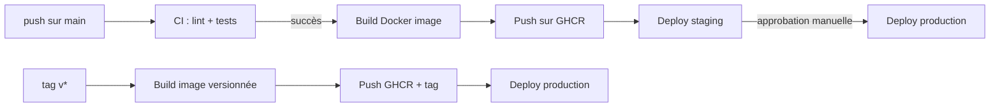

## Architecture du pipeline de déploiement

Le déploiement continu de `mon-app` suit ce flux :



## Construire et publier une image Docker

### Le Dockerfile de `mon-app`

```dockerfile
# Dockerfile — exemple Python, adaptez à votre stack
FROM python:3.12-slim

WORKDIR /app

COPY requirements.txt .
RUN pip install --no-cache-dir -r requirements.txt

COPY src/ ./src/

EXPOSE 8000
CMD ["uvicorn", "src.main:app", "--host", "0.0.0.0", "--port", "8000"]
```

### Publier sur GitHub Container Registry (GHCR)

GHCR est le registry Docker intégré à GitHub. Chaque image est hébergée à `ghcr.io/<owner>/<repo>`.

```yaml
# .github/workflows/docker.yml
name: Docker Build & Push

on:
  push:
    branches: [main]
    tags: ["v*"]

permissions:
  contents: read
  packages: write # Nécessaire pour GHCR

jobs:
  build-push:
    runs-on: ubuntu-latest
    steps:
      - uses: actions/checkout@v6

      # Préparer les métadonnées de l'image (tags, labels)
      - uses: docker/metadata-action@v5
        id: meta
        with:
          images: ghcr.io/${{ github.repository }}
          tags: |
            type=ref,event=branch
            type=semver,pattern={{version}}
            type=semver,pattern={{major}}.{{minor}}
            type=sha,prefix=sha-,format=short

      # Configurer QEMU pour le build multi-arch
      - uses: docker/setup-qemu-action@v3

      # Configurer BuildKit (requis pour le cache et multi-arch)
      - uses: docker/setup-buildx-action@v3

      # Se connecter à GHCR
      - uses: docker/login-action@v3
        with:
          registry: ghcr.io
          username: ${{ github.actor }}
          password: ${{ secrets.GITHUB_TOKEN }}

      # Build et push
      - uses: docker/build-push-action@v6
        with:
          context: .
          platforms: linux/amd64,linux/arm64 # Multi-arch obligatoire
          push: true
          tags: ${{ steps.meta.outputs.tags }}
          labels: ${{ steps.meta.outputs.labels }}
          cache-from: type=gha
          cache-to: type=gha,mode=max
```

### Les tags générés par `docker/metadata-action`

Selon l'événement qui déclenche le workflow :

| Événement       | Tags générés                            |
| --------------- | --------------------------------------- |
| Push sur `main` | `main`, `sha-abc1234`                   |
| Tag `v1.2.3`    | `1.2.3`, `1.2`, `latest`, `sha-abc1234` |
| Tag `v2.0.0`    | `2.0.0`, `2.0`, `latest`, `sha-abc1234` |

La règle `type=semver,pattern={{major}}.{{minor}}` crée un tag flottant `1.2` qui pointe toujours vers le dernier patch `1.2.x`.

## Déployer sur Kubernetes

### Le manifeste Kubernetes de `mon-app`

```yaml
# k8s/deployment.yaml
apiVersion: apps/v1
kind: Deployment
metadata:
  name: mon-app
  namespace: apps
spec:
  replicas: 2
  selector:
    matchLabels:
      app: mon-app
  template:
    metadata:
      labels:
        app: mon-app
    spec:
      containers:
        - name: mon-app
          image: ghcr.io/mon-org/mon-app:latest # Remplacé dynamiquement
          ports:
            - containerPort: 8000
          livenessProbe:
            httpGet:
              path: /health
              port: 8000
            initialDelaySeconds: 10
          readinessProbe:
            httpGet:
              path: /health
              port: 8000
---
apiVersion: v1
kind: Service
metadata:
  name: mon-app
  namespace: apps
spec:
  selector:
    app: mon-app
  ports:
    - port: 80
      targetPort: 8000
```

### Déployer depuis GitHub Actions

Deux approches principales :

**1. kubectl direct** (si le cluster est accessible depuis internet) :

```yaml
- uses: azure/k8s-set-context@v4
  with:
    method: kubeconfig
    kubeconfig: ${{ secrets.KUBECONFIG }}

- run: |
    kubectl set image deployment/mon-app \
      mon-app=ghcr.io/${{ github.repository }}:sha-${{ github.sha }}
    kubectl rollout status deployment/mon-app -n apps
```

**2. GitOps avec ArgoCD / Flux** (recommandé pour les clusters privés) :

Le workflow met à jour un dépôt de configuration Git. ArgoCD ou Flux détecte le changement et applique le déploiement de façon autonome.

```yaml
- name: Mettre à jour l'image dans le dépôt GitOps
  env:
    TAG: sha-${{ github.sha }}
  run: |
    # Modifier le tag de l'image dans le manifeste
    sed -i "s|image: ghcr.io/mon-org/mon-app:.*|image: ghcr.io/mon-org/mon-app:$TAG|" \
      k8s/deployment.yaml

    git config user.name "github-actions[bot]"
    git config user.email "github-actions[bot]@users.noreply.github.com"
    git add k8s/deployment.yaml
    git commit -m "chore: update mon-app to $TAG"
    git push
```

## Workflow complet : CI + CD intégrés

```yaml
# .github/workflows/ci-cd.yml
name: CI/CD

on:
  push:
    branches: [main]
    tags: ["v*"]
  pull_request:
    branches: [main]

permissions:
  contents: read
  packages: write

concurrency:
  group: cicd-${{ github.ref }}
  cancel-in-progress: ${{ !startsWith(github.ref, 'refs/tags/') }}

jobs:
  lint:
    runs-on: ubuntu-latest
    steps:
      - uses: actions/checkout@v6
      - uses: actions/setup-python@v5
        with:
          python-version: "3.12"
          cache: pip
      - run: pip install ruff && ruff check . && ruff format --check .

  test:
    runs-on: ubuntu-latest
    strategy:
      matrix:
        python-version: ["3.11", "3.12"]
    steps:
      - uses: actions/checkout@v6
      - uses: actions/setup-python@v5
        with:
          python-version: ${{ matrix.python-version }}
          cache: pip
      - run: pip install -r requirements.txt -r requirements-dev.txt
      - run: pytest --cov=app --cov-report=xml
      - uses: actions/upload-artifact@v4
        if: always()
        with:
          name: coverage-${{ matrix.python-version }}
          path: coverage.xml

  build-push:
    needs: [lint, test]
    runs-on: ubuntu-latest
    # Build uniquement sur main ou sur les tags, pas sur les PRs
    if: github.event_name != 'pull_request'
    outputs:
      image-tag: ${{ steps.meta.outputs.version }}
    steps:
      - uses: actions/checkout@v6

      - uses: docker/metadata-action@v5
        id: meta
        with:
          images: ghcr.io/${{ github.repository }}
          tags: |
            type=ref,event=branch
            type=semver,pattern={{version}}
            type=sha,prefix=,format=short

      - uses: docker/setup-qemu-action@v3
      - uses: docker/setup-buildx-action@v3

      - uses: docker/login-action@v3
        with:
          registry: ghcr.io
          username: ${{ github.actor }}
          password: ${{ secrets.GITHUB_TOKEN }}

      - uses: docker/build-push-action@v6
        with:
          context: .
          platforms: linux/amd64,linux/arm64
          push: true
          tags: ${{ steps.meta.outputs.tags }}
          labels: ${{ steps.meta.outputs.labels }}
          cache-from: type=gha
          cache-to: type=gha,mode=max

  deploy-staging:
    needs: build-push
    runs-on: ubuntu-latest
    environment: staging
    if: github.ref == 'refs/heads/main'
    steps:
      - run: |
          echo "Déploiement de l'image tag: ${{ needs.build-push.outputs.image-tag }}"
          echo "Vers l'environnement staging"
          # kubectl set image deployment/mon-app ...

  deploy-production:
    needs: [build-push, deploy-staging]
    runs-on: ubuntu-latest
    environment: production # Requiert une approbation manuelle
    if: startsWith(github.ref, 'refs/tags/v')
    steps:
      - run: |
          echo "Déploiement de la version ${{ needs.build-push.outputs.image-tag }}"
          echo "Vers la production"
```

## Créer une release GitHub

Quand un tag SemVer est poussé, créer automatiquement une release GitHub :

```yaml
create-release:
  needs: build-push
  runs-on: ubuntu-latest
  if: startsWith(github.ref, 'refs/tags/v')
  permissions:
    contents: write
  steps:
    - uses: actions/checkout@v6
      with:
        fetch-depth: 0 # Historique complet pour le changelog

    - name: Créer la release
      uses: softprops/action-gh-release@v2
      with:
        generate_release_notes: true # Génère automatiquement depuis les commits
        make_latest: true
```

> **Exercice** : Ajoutez le Dockerfile à `mon-app` et créez le workflow `docker.yml`. Poussez sur `main` et vérifiez que l'image apparaît dans l'onglet **Packages** du dépôt sur GitHub. Créez ensuite un tag `v0.1.0` et vérifiez qu'une release est créée avec l'image taguée `0.1.0`.

<details>
<summary>Solution</summary>

```bash
# Créer le Dockerfile et le workflow
# (voir le contenu ci-dessus)

# Pousser sur main pour déclencher le build
git add Dockerfile .github/workflows/docker.yml
git commit -m "feat: add Docker build and publish workflow"
git push origin main

# Attendre que le workflow s'exécute (~2-3 minutes)
# Vérifier l'image dans : github.com/<your-login>/mon-app/pkgs/container/mon-app

# Créer et pousser un tag de release
git tag v0.1.0
git push origin v0.1.0

# Vérifier :
# - L'image ghcr.io/<login>/mon-app:0.1.0 est créée
# - Une release "v0.1.0" apparaît dans l'onglet Releases
```

L'onglet Packages de votre dépôt GitHub affichera `mon-app` avec les tags `main`, `sha-xxxxxx`, et après le tag `0.1.0`, `latest`.

Rendez l'image publique si nécessaire : Settings du package → Make public.

</details>
