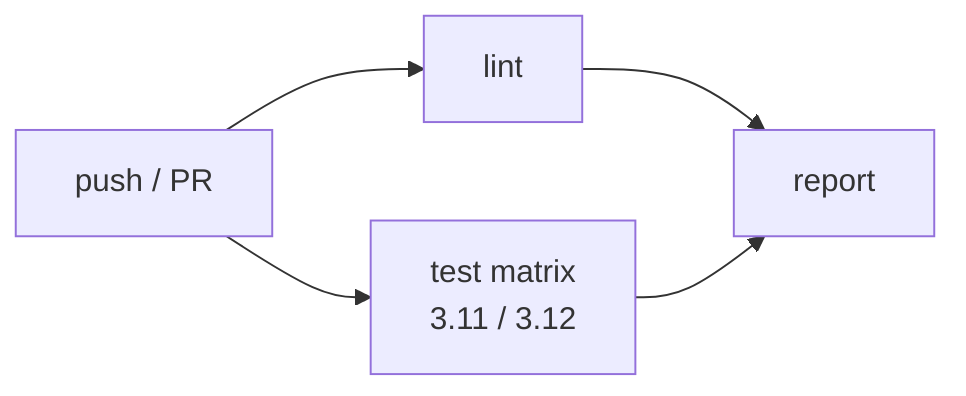

## Ce que couvre l'intégration continue

Une CI robuste pour une application Python comprend :

1. **Lint & formatage** : vérifier le style et détecter les erreurs statiques.
2. **Tests unitaires et d'intégration** : valider que le code se comporte comme attendu.
3. **Couverture de code** : mesurer la proportion de code testée.
4. **Rapport sur les PRs** : afficher les résultats directement dans l'interface GitHub.

## Le workflow CI complet de `demo-api`

Voici le workflow cible que nous allons construire étape par étape :



### Étape 1 : Lint avec Ruff

[Ruff](https://github.com/astral-sh/ruff) est un linter Python ultra-rapide qui remplace Flake8, isort, et plusieurs autres outils.

```yaml
  lint:
    runs-on: ubuntu-latest
    steps:
      - uses: actions/checkout@v4

      - uses: actions/setup-python@v5
        with:
          python-version: "3.12"
          cache: pip

      - run: pip install ruff

      - name: Vérifier le formatage
        run: ruff format --check .

      - name: Vérifier le lint
        run: ruff check .
```

### Étape 2 : Tests avec couverture

```yaml
  test:
    runs-on: ubuntu-latest
    strategy:
      fail-fast: false
      matrix:
        python-version: ["3.11", "3.12"]

    steps:
      - uses: actions/checkout@v4

      - uses: actions/setup-python@v5
        with:
          python-version: ${{ matrix.python-version }}
          cache: pip
          cache-dependency-path: |
            requirements.txt
            requirements-dev.txt

      - name: Installer les dépendances
        run: pip install -r requirements.txt -r requirements-dev.txt

      - name: Lancer les tests
        run: pytest --cov=app --cov-report=xml --cov-report=term-missing

      - name: Uploader le rapport de coverage
        uses: actions/upload-artifact@v4
        if: always()
        with:
          name: coverage-${{ matrix.python-version }}
          path: coverage.xml
```

### Étape 3 : Rapport de coverage sur les PRs

L'action `py-cov-comment` ajoute automatiquement un commentaire sur la PR avec le rapport de couverture :

```yaml
  coverage-report:
    needs: test
    runs-on: ubuntu-latest
    if: github.event_name == 'pull_request'
    permissions:
      pull-requests: write
    steps:
      - uses: actions/checkout@v4

      - uses: actions/download-artifact@v4
        with:
          name: coverage-3.12
          path: coverage/

      - uses: py-actions/py-cov-comment@v1
        with:
          github-token: ${{ secrets.GITHUB_TOKEN }}
          coverage-xml-file: coverage/coverage.xml
```

### Le workflow complet

```yaml
# .github/workflows/ci.yml
name: CI

on:
  push:
    branches: [main]
  pull_request:
    branches: [main]

permissions:
  contents: read

concurrency:
  group: ci-${{ github.ref }}
  cancel-in-progress: true

jobs:
  lint:
    name: "Lint"
    runs-on: ubuntu-latest
    steps:
      - uses: actions/checkout@v4

      - uses: actions/setup-python@v5
        with:
          python-version: "3.12"
          cache: pip

      - run: pip install ruff

      - run: ruff format --check .

      - run: ruff check .

  test:
    name: "Tests (Python ${{ matrix.python-version }})"
    runs-on: ubuntu-latest
    strategy:
      fail-fast: false
      matrix:
        python-version: ["3.11", "3.12"]
    steps:
      - uses: actions/checkout@v4

      - uses: actions/setup-python@v5
        with:
          python-version: ${{ matrix.python-version }}
          cache: pip
          cache-dependency-path: |
            requirements.txt
            requirements-dev.txt

      - run: pip install -r requirements.txt -r requirements-dev.txt

      - run: pytest --cov=app --cov-report=xml --cov-report=term-missing

      - uses: actions/upload-artifact@v4
        if: always()
        with:
          name: coverage-${{ matrix.python-version }}
          path: coverage.xml

  coverage-comment:
    name: "Rapport de coverage"
    needs: test
    runs-on: ubuntu-latest
    if: github.event_name == 'pull_request'
    permissions:
      contents: read
      pull-requests: write
    steps:
      - uses: actions/checkout@v4

      - uses: actions/download-artifact@v4
        with:
          name: coverage-3.12
          path: coverage/

      - uses: py-actions/py-cov-comment@v1
        with:
          github-token: ${{ secrets.GITHUB_TOKEN }}
          coverage-xml-file: coverage/coverage.xml
```

## Ajouter un badge de statut au README

GitHub génère automatiquement un badge pour chaque workflow. Ajoutez-le dans le `README.md` du projet :

```markdown
[](https://github.com/votre-login/demo-api/actions/workflows/ci.yml)
```

Ce badge passe au vert quand le dernier run sur la branche par défaut a réussi, et au rouge en cas d'échec.

## Branch protection rules

Pour imposer que la CI réussisse avant tout merge, configurez une **branch protection rule** sur `main` :

**Settings → Branches → Add branch protection rule**

- Branch name pattern : `main`
- ✅ Require status checks to pass before merging
  - Ajouter : `lint`, `test (3.11)`, `test (3.12)`
- ✅ Require branches to be up to date before merging

Avec cette configuration, il est impossible de merger une PR si la CI a échoué ou si la branche est en retard sur `main`.

## Intégrer un outil de qualité de code externe

### Codecov

[Codecov](https://codecov.io) centralise les rapports de coverage de tous les dépôts :

```yaml
      - uses: codecov/codecov-action@v5
        with:
          token: ${{ secrets.CODECOV_TOKEN }}
          files: coverage.xml
          flags: unittests
          fail_ci_if_error: true
```

### SonarQube / SonarCloud

```yaml
      - uses: SonarSource/sonarcloud-github-action@master
        env:
          GITHUB_TOKEN: ${{ secrets.GITHUB_TOKEN }}
          SONAR_TOKEN: ${{ secrets.SONAR_TOKEN }}
```

> **Exercice** : Finalisez le workflow CI complet de `demo-api` avec lint (Ruff) et tests matriciels. Créez une branch protection rule sur `main` qui exige le passage des deux jobs. Créez une PR depuis une branche `feature/add-endpoint` et vérifiez que le badge de statut apparaît dans la PR avant le merge.

<details>
<summary>Solution</summary>

1. Copiez le workflow complet ci-dessus dans `.github/workflows/ci.yml`.

2. Créez les fichiers de configuration Ruff :

```toml
# pyproject.toml
[tool.ruff]
target-version = "py311"
line-length = 88

[tool.ruff.lint]
select = ["E", "F", "I", "N", "UP"]

[tool.pytest.ini_options]
testpaths = ["tests"]
```

3. Poussez sur `main` pour déclencher une première run et enregistrer les status checks.

4. Dans Settings → Branches → Add rule :
   - Pattern : `main`
   - Cochez "Require status checks" et ajoutez `lint`, `test (3.11)`, `test (3.12)`

5. Créez la branche et la PR :

```bash
git checkout -b feature/add-endpoint
# Ajoutez un endpoint dans app/routers/items.py et son test
git add .
git commit -m "feat: add /items endpoint"
git push -u origin feature/add-endpoint
gh pr create --title "feat: add /items endpoint" --body "Ajout de l'endpoint items"
```

La PR affiche automatiquement les status checks. Si tous les checks sont verts, le bouton Merge devient disponible. Si un check échoue, il est bloqué.

</details>
