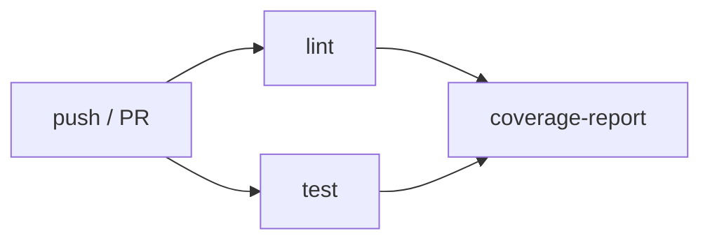

## Ce que couvre l'intégration continue

Une CI robuste comprend :

1. **Lint & formatage** : vérifier le style et détecter les erreurs statiques.
2. **Tests unitaires et d'intégration** : valider que le code se comporte comme attendu.
3. **Couverture de code** : mesurer la proportion de code testée.
4. **Rapport sur les PRs** : afficher les résultats directement dans l'interface GitHub.

## Workflow cible



## Étape 1 : Lint et tests — par stack

Le lint et les tests sont la seule phase réellement dépendante du langage. Le reste du pipeline (Docker build, push, déploiement) est identique quelle que soit la stack — nous y reviendrons dans les chapitres suivants.

Choisissez votre stack pour voir les jobs `lint` et `test` correspondants :

<details class="lang-variant" open>
<summary>Python — Ruff + pytest</summary>
<div class="lang-variant-body">

```yaml
lint:
  name: "Lint"
  runs-on: ubuntu-latest
  steps:
    - uses: actions/checkout@v6

    - uses: actions/setup-python@v5
      with:
        python-version: "3.12"
        cache: pip

    - run: pip install ruff
    - run: ruff format --check .
    - run: ruff check .

test:
  name: "Tests (Python ${{ matrix.python-version }})"
  runs-on: ubuntu-latest
  strategy:
    fail-fast: false
    matrix:
      python-version: ["3.11", "3.12"]
  steps:
    - uses: actions/checkout@v6

    - uses: actions/setup-python@v5
      with:
        python-version: ${{ matrix.python-version }}
        cache: pip
        cache-dependency-path: |
          requirements.txt
          requirements-dev.txt

    - run: pip install -r requirements.txt -r requirements-dev.txt
    - run: pytest --cov=src --cov-report=xml --cov-report=term-missing

    - uses: actions/upload-artifact@v4
      if: always()
      with:
        name: coverage-${{ matrix.python-version }}
        path: coverage.xml
```

**Outils** : [Ruff](https://github.com/astral-sh/ruff) (lint + format), [pytest](https://pytest.org) + [pytest-cov](https://pytest-cov.readthedocs.io/).

**Rapport de coverage** : récupérez l'artifact `coverage-3.12` dans le job `coverage-report` ci-dessous.

</div>
</details>

<details class="lang-variant">
<summary>Node.js — ESLint + Vitest</summary>
<div class="lang-variant-body">

```yaml
lint:
  name: "Lint"
  runs-on: ubuntu-latest
  steps:
    - uses: actions/checkout@v6

    - uses: actions/setup-node@v4
      with:
        node-version: "22"
        cache: npm

    - run: npm ci
    - run: npm run lint # npx eslint src/

test:
  name: "Tests (Node ${{ matrix.node-version }})"
  runs-on: ubuntu-latest
  strategy:
    fail-fast: false
    matrix:
      node-version: ["20", "22"]
  steps:
    - uses: actions/checkout@v6

    - uses: actions/setup-node@v4
      with:
        node-version: ${{ matrix.node-version }}
        cache: npm

    - run: npm ci
    - run: npm test -- --coverage --reporter=verbose

    - uses: actions/upload-artifact@v4
      if: always()
      with:
        name: coverage-node-${{ matrix.node-version }}
        path: coverage/
```

**Outils** : [ESLint](https://eslint.org/) (lint), [Vitest](https://vitest.dev/) (tests + coverage via V8).

**`package.json`** : assurez-vous que `scripts.lint` et `scripts.test` sont définis.

</div>
</details>

<details class="lang-variant">
<summary>Angular — ng lint + Vitest (via ng test)</summary>
<div class="lang-variant-body">

```yaml
lint:
  name: "Lint"
  runs-on: ubuntu-latest
  steps:
    - uses: actions/checkout@v6

    - uses: actions/setup-node@v4
      with:
        node-version: "22"
        cache: npm

    - run: npm ci
    - run: npx ng lint

test:
  name: "Tests"
  runs-on: ubuntu-latest
  steps:
    - uses: actions/checkout@v6

    - uses: actions/setup-node@v4
      with:
        node-version: "22"
        cache: npm

    - run: npm ci

    - name: Lancer les tests
      run: npx ng test --watch=false --code-coverage

    - uses: actions/upload-artifact@v4
      if: always()
      with:
        name: coverage-angular
        path: coverage/
```

**Outils** : `ng lint` (ESLint via Angular CLI), `ng test` (Vitest depuis Angular 19 — Karma est déprécié).

**`angular.json`** : configurez `test.builder` sur `@angular/build:unit-test` pour Vitest. Pour les projets Angular < 19 utilisant encore Karma, remplacez par `ng test --no-watch --browsers=ChromeHeadless`.

</div>
</details>

<details class="lang-variant">
<summary>Java — Checkstyle + JUnit (Maven / Gradle)</summary>
<div class="lang-variant-body">

**Avec Maven :**

```yaml
lint:
  name: "Lint (Checkstyle)"
  runs-on: ubuntu-latest
  steps:
    - uses: actions/checkout@v6

    - uses: actions/setup-java@v4
      with:
        java-version: "21"
        distribution: temurin
        cache: maven

    - run: mvn --no-transfer-progress checkstyle:check

test:
  name: "Tests (Java ${{ matrix.java }})"
  runs-on: ubuntu-latest
  strategy:
    fail-fast: false
    matrix:
      java: ["21", "17"]
  steps:
    - uses: actions/checkout@v6

    - uses: actions/setup-java@v4
      with:
        java-version: ${{ matrix.java }}
        distribution: temurin
        cache: maven

    - run: mvn --no-transfer-progress verify

    - uses: actions/upload-artifact@v4
      if: always()
      with:
        name: surefire-reports-java-${{ matrix.java }}
        path: target/surefire-reports/
```

**Avec Gradle :**

```yaml
- run: ./gradlew check # lint : Checkstyle + SpotBugs
- run: ./gradlew test jacocoTestReport
```

**Outils** : [Checkstyle](https://checkstyle.org/) / [SpotBugs](https://spotbugs.github.io/) (lint), JUnit 5 (tests), JaCoCo (coverage).

**Quarkus** : `mvn verify` lance les tests Quarkus (inclus `@QuarkusTest`). **Spring Boot** : identique, Spring Boot Test est découvert automatiquement.

</div>
</details>

<details class="lang-variant">
<summary>PHP — PHP_CodeSniffer + PHPUnit / Pest</summary>
<div class="lang-variant-body">

```yaml
lint:
  name: "Lint (PHPCS + PHPStan)"
  runs-on: ubuntu-latest
  steps:
    - uses: actions/checkout@v6

    # PHP est pré-installé sur ubuntu-latest (plusieurs versions via update-alternatives)
    - name: Installer Composer et les dépendances
      run: composer install --no-interaction --prefer-dist

    - run: vendor/bin/phpcs --standard=PSR12 src/
    - run: vendor/bin/phpstan analyse src/ --level=6

test:
  name: "Tests (PHP ${{ matrix.php }})"
  runs-on: ubuntu-latest
  strategy:
    fail-fast: false
    matrix:
      php: ["8.2", "8.3"]
  steps:
    - uses: actions/checkout@v6

    - uses: shivammathur/setup-php@v2
      with:
        php-version: ${{ matrix.php }}
        coverage: xdebug

    - run: composer install --no-interaction --prefer-dist

    - name: Lancer les tests
      run: vendor/bin/phpunit --coverage-clover coverage.xml
      # Ou avec Pest : vendor/bin/pest --coverage --coverage-clover coverage.xml

    - uses: actions/upload-artifact@v4
      if: always()
      with:
        name: coverage-php-${{ matrix.php }}
        path: coverage.xml
```

**Outils** : [PHP_CodeSniffer](https://github.com/squizlabs/PHP_CodeSniffer) + [PHPStan](https://phpstan.org/) (lint), [PHPUnit](https://phpunit.de/) ou [Pest](https://pestphp.com/) (tests).

**Note** : `shivammathur/setup-php@v2` permet de sélectionner précisément la version PHP, préférable à la version pré-installée sur le runner.

</div>
</details>

## Étape 2 : Rapport de coverage sur les PRs

Cette étape est **identique quelle que soit la stack**, à condition que votre job `test` produise un fichier de coverage au format XML (Cobertura ou LCOV) :

```yaml
coverage-report:
  name: "Rapport de coverage"
  needs: test
  runs-on: ubuntu-latest
  if: github.event_name == 'pull_request'
  permissions:
    contents: read
    pull-requests: write
  steps:
    - uses: actions/checkout@v6

    # Télécharger le rapport produit par le job test
    # Adaptez le nom de l'artifact selon votre stack :
    # coverage-3.12 (Python), coverage-node-22 (Node), coverage-angular, etc.
    - uses: actions/download-artifact@v4
      with:
        name: coverage-3.12
        path: coverage/

    - uses: py-actions/py-cov-comment@v1
      with:
        github-token: ${{ secrets.GITHUB_TOKEN }}
        coverage-xml-file: coverage/coverage.xml
```

## Workflow complet

```yaml
# .github/workflows/ci.yml
name: CI

on:
  push:
    branches: [main]
  pull_request:
    branches: [main]

permissions:
  contents: read

concurrency:
  group: ci-${{ github.ref }}
  cancel-in-progress: true

jobs:
  # ── Collez ici les jobs lint + test de votre stack ──

  coverage-report:
    name: "Rapport de coverage"
    needs: test
    runs-on: ubuntu-latest
    if: github.event_name == 'pull_request'
    permissions:
      contents: read
      pull-requests: write
    steps:
      - uses: actions/checkout@v6
      - uses: actions/download-artifact@v4
        with:
          name: coverage-3.12 # Adaptez selon votre stack
          path: coverage/
      - uses: py-actions/py-cov-comment@v1
        with:
          github-token: ${{ secrets.GITHUB_TOKEN }}
          coverage-xml-file: coverage/coverage.xml
```

## Ajouter un badge de statut au README

GitHub génère automatiquement un badge pour chaque workflow. Ajoutez-le dans le `README.md` du projet :

```markdown
[](https://github.com/votre-login/mon-app/actions/workflows/ci.yml)
```

Ce badge passe au vert quand le dernier run sur la branche par défaut a réussi, et au rouge en cas d'échec.

## Branch protection rules

Pour imposer que la CI réussisse avant tout merge, configurez une **branch protection rule** sur `main` :

**Settings → Branches → Add branch protection rule**

- Branch name pattern : `main`
- ✅ Require status checks to pass before merging
  - Ajouter les jobs correspondants à votre stack (ex. `lint`, `test (3.11)`, `test (3.12)` pour Python)
- ✅ Require branches to be up to date before merging

Avec cette configuration, il est impossible de merger une PR si la CI a échoué ou si la branche est en retard sur `main`.

## Intégrer un outil de qualité de code externe

### Codecov

[Codecov](https://codecov.io) centralise les rapports de coverage de tous les dépôts et supporte tous les formats (XML Cobertura, LCOV, JaCoCo…) :

```yaml
- uses: codecov/codecov-action@v5
  with:
    token: ${{ secrets.CODECOV_TOKEN }}
    files: coverage.xml
    flags: unittests
    fail_ci_if_error: true
```

### SonarQube / SonarCloud

```yaml
- uses: SonarSource/sonarcloud-github-action@master
  env:
    GITHUB_TOKEN: ${{ secrets.GITHUB_TOKEN }}
    SONAR_TOKEN: ${{ secrets.SONAR_TOKEN }}
```

> **Exercice** : Finalisez le workflow CI complet de `mon-app` avec les jobs lint et test adaptés à votre stack. Créez une branch protection rule sur `main` qui exige le passage des deux jobs. Créez une PR depuis une branche `feature/add-endpoint` et vérifiez que le badge de statut apparaît dans la PR avant le merge.

<details>
<summary>Solution (exemple Python)</summary>

1. Copiez le workflow Python ci-dessus dans `.github/workflows/ci.yml`.

2. Créez le fichier de configuration :

```toml
# pyproject.toml
[tool.ruff]
target-version = "py311"
line-length = 88

[tool.ruff.lint]
select = ["E", "F", "I", "N", "UP"]

[tool.pytest.ini_options]
testpaths = ["tests"]
```

3. Poussez sur `main` pour déclencher une première run et enregistrer les status checks.

4. Dans Settings → Branches → Add rule :
   - Pattern : `main`
   - Cochez "Require status checks" et ajoutez `lint`, `test (3.11)`, `test (3.12)`

5. Créez la branche et la PR :

```bash
git checkout -b feature/add-endpoint
git add .
git commit -m "feat: add /items endpoint"
git push -u origin feature/add-endpoint
gh pr create --title "feat: add /items endpoint" --body "Ajout de l'endpoint items"
```

La PR affiche automatiquement les status checks. Si tous les checks sont verts, le bouton Merge devient disponible. Si un check échoue, il est bloqué.

</details>
