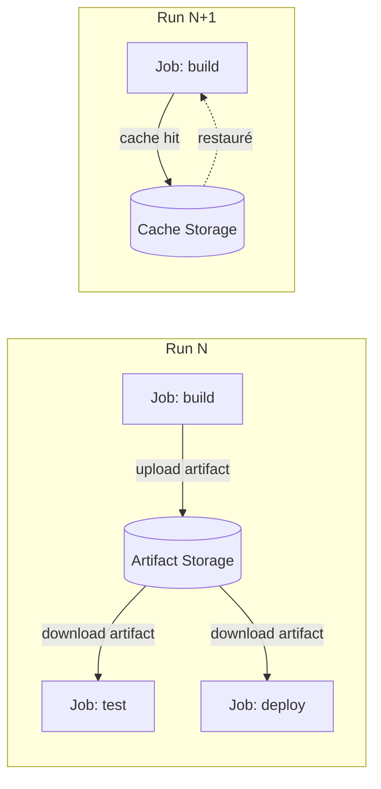
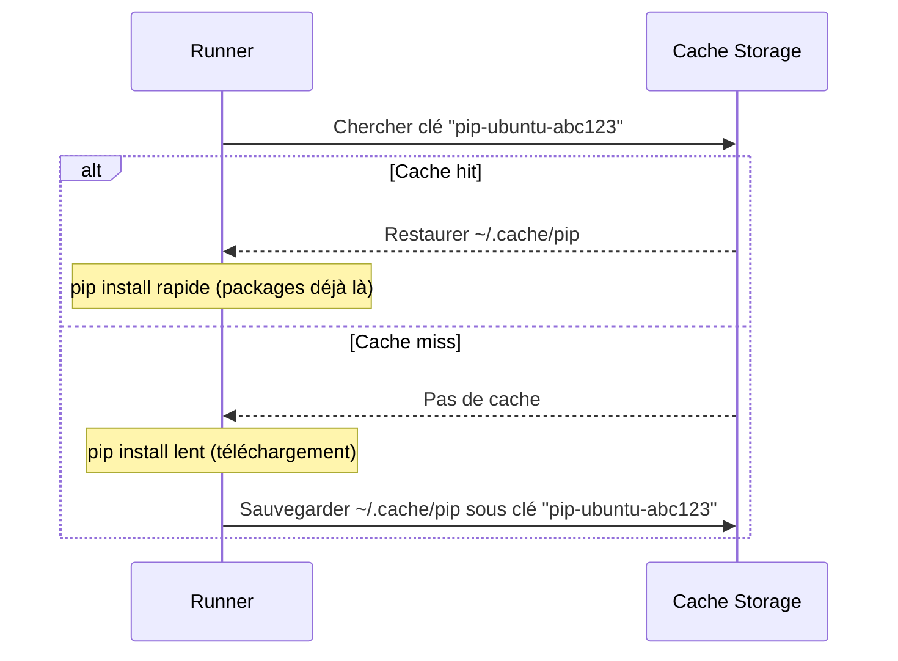

## Pourquoi les artifacts et le cache ?

Chaque job d'un workflow tourne sur un **runner isolé** et éphémère. À la fin du job, le système de fichiers disparaît. Deux mécanismes permettent de dépasser cette isolation :

- **Les artifacts** : persister des fichiers **entre les runs** ou **entre les jobs** pour les télécharger ou les transmettre.
- **Le cache** : réutiliser des dossiers coûteux à reconstruire (dépendances, compilations) d'**un run à l'autre** pour accélérer les builds.



## Les artifacts

### Uploader un artifact

```yaml
jobs:
  build:
    runs-on: ubuntu-latest
    steps:
      - uses: actions/checkout@v4

      - name: Builder l'application
        run: python -m build

      - name: Uploader le wheel
        uses: actions/upload-artifact@v4
        with:
          name: python-package             # Nom de l'artifact
          path: dist/                      # Fichier(s) ou dossier à archiver
          retention-days: 7               # Durée de conservation (défaut : 90 jours)
```

Après le run, l'artifact est téléchargeable depuis l'interface GitHub dans l'onglet Actions → le run → section "Artifacts".

### Télécharger un artifact dans un autre job

```yaml
jobs:
  build:
    runs-on: ubuntu-latest
    steps:
      - uses: actions/checkout@v4
      - run: python -m build
      - uses: actions/upload-artifact@v4
        with:
          name: dist-files
          path: dist/

  publish:
    runs-on: ubuntu-latest
    needs: build                           # Attendre que build soit terminé
    steps:
      - uses: actions/download-artifact@v4
        with:
          name: dist-files                 # Même nom que l'upload
          path: dist/                      # Dossier de destination

      - run: ls -la dist/                  # Les fichiers sont là
```

### Cas d'usage typiques des artifacts

- **Rapports de tests** : HTML coverage, JUnit XML pour l'affichage dans GitHub
- **Binaires compilés** : wheel Python, JAR Java, binaire Go
- **Images Docker en tar** : passer une image entre jobs sans registry
- **Logs de débogage** : conserver les logs d'un job qui a échoué

### Artifacts de rapports de test

```yaml
- name: Lancer les tests avec coverage
  run: pytest --cov=app --cov-report=html --cov-report=xml

- name: Uploader le rapport de coverage
  uses: actions/upload-artifact@v4
  if: always()                             # Uploader même si les tests ont échoué
  with:
    name: coverage-report
    path: htmlcov/
    retention-days: 30
```

La condition `if: always()` garantit que le rapport est uploadé même si l'étape `pytest` a échoué (exit code non nul).

## Le cache

### Principe du cache

Le cache permet de sauvegarder un dossier après un run et de le restaurer au début du run suivant. La **clé de cache** détermine si une entrée est valide.



### Utilisation manuelle avec `actions/cache@v4`

```yaml
- name: Configurer le cache pip
  uses: actions/cache@v4
  with:
    path: ~/.cache/pip
    key: ${{ runner.os }}-pip-${{ hashFiles('**/requirements*.txt') }}
    restore-keys: |
      ${{ runner.os }}-pip-
```

Explications :

- `path` : le dossier à mettre en cache.
- `key` : clé exacte. `hashFiles()` calcule un hash des fichiers de dépendances — si `requirements.txt` change, la clé change et le cache est invalidé.
- `restore-keys` : clés de repli. Si la clé exacte n'existe pas, on essaie ces préfixes dans l'ordre. Cela permet de repartir d'un cache partiel plutôt que de rien.

### Cache via les actions `setup-*`

Les actions officielles `setup-python`, `setup-node`, `setup-go` intègrent directement le cache :

```yaml
# Python
- uses: actions/setup-python@v5
  with:
    python-version: "3.12"
    cache: "pip"

# Node.js
- uses: actions/setup-node@v4
  with:
    node-version: "20"
    cache: "npm"

# Go
- uses: actions/setup-go@v5
  with:
    go-version: "1.23"
    cache: true               # Met en cache le module cache Go
```

C'est l'approche recommandée — moins de configuration et comportement optimal par défaut.

### Cache Docker layers avec BuildKit

```yaml
- uses: docker/setup-buildx-action@v3

- uses: docker/build-push-action@v6
  with:
    context: .
    cache-from: type=gha              # Lire depuis le cache GitHub Actions
    cache-to: type=gha,mode=max       # Écrire dans le cache GitHub Actions
    push: false
```

Ce cache permet de réutiliser les layers Docker d'un run à l'autre. `mode=max` cache toutes les layers intermédiaires.

### Limites et bonnes pratiques

- **Limite de taille** : 10 GB par dépôt. Au-delà, GitHub supprime les entrées les plus anciennes.
- **Expiration** : les entrées non accédées depuis 7 jours sont supprimées.
- **Isolation** : le cache n'est pas partagé entre les forks par défaut (sécurité).
- **Non modifiable** : une entrée de cache ne peut pas être mise à jour — elle est créée une fois et immuable. Pour invalider, changez la clé.

> **Règle d'or** : si votre fichier de dépendances (`requirements.txt`, `package.json`, `go.sum`) fait partie du hash de la clé, le cache est automatiquement invalidé quand les dépendances changent.

## Combiner artifacts et cache : le pattern build-test-deploy

Voici un pattern complet qui illustre les deux mécanismes :

```yaml
name: Build, Test & Deploy

on:
  push:
    branches: [main]

jobs:
  build:
    runs-on: ubuntu-latest
    steps:
      - uses: actions/checkout@v4

      - uses: actions/setup-python@v5
        with:
          python-version: "3.12"
          cache: pip                         # Cache des dépendances

      - run: |
          pip install -r requirements.txt
          pip install -r requirements-dev.txt
          python -m build                    # Construit le package

      - uses: actions/upload-artifact@v4    # Partage le package avec les jobs suivants
        with:
          name: dist
          path: dist/

  test:
    runs-on: ubuntu-latest
    needs: build
    steps:
      - uses: actions/checkout@v4

      - uses: actions/setup-python@v5
        with:
          python-version: "3.12"
          cache: pip

      - uses: actions/download-artifact@v4  # Récupère le package buildé
        with:
          name: dist
          path: dist/

      - run: |
          pip install -r requirements-dev.txt
          pytest --cov=app --cov-report=xml

      - uses: actions/upload-artifact@v4
        if: always()
        with:
          name: coverage-report
          path: coverage.xml

  deploy:
    runs-on: ubuntu-latest
    needs: test
    if: github.ref == 'refs/heads/main'     # Seulement sur main
    steps:
      - uses: actions/download-artifact@v4
        with:
          name: dist
          path: dist/
      - run: echo "Déploiement du package depuis dist/"
```

> **Exercice** : Modifiez le workflow `ci.yml` de `mon-app` pour qu'il :
> 1. Génère un rapport de coverage HTML avec `pytest --cov=app --cov-report=html`.
> 2. Upload ce rapport comme artifact nommé `coverage-report`, même si les tests échouent.
> 3. Configure le cache pip via `actions/setup-python@v5` avec `cache: pip`.
> Vérifiez que l'artifact apparaît bien dans l'interface GitHub après le run.

<details>
<summary>Solution</summary>

```yaml
name: CI

on:
  push:
    branches: [main]
  pull_request:
    branches: [main]

jobs:
  test:
    runs-on: ubuntu-latest
    steps:
      - name: Cloner le code
        uses: actions/checkout@v4

      - name: Installer Python 3.12
        uses: actions/setup-python@v5
        with:
          python-version: "3.12"
          cache: "pip"
          cache-dependency-path: |
            requirements.txt
            requirements-dev.txt

      - name: Installer les dépendances
        run: |
          pip install -r requirements.txt
          pip install -r requirements-dev.txt

      - name: Lancer les tests avec coverage
        run: pytest --cov=app --cov-report=html --cov-report=term

      - name: Uploader le rapport de coverage
        uses: actions/upload-artifact@v4
        if: always()
        with:
          name: coverage-report
          path: htmlcov/
          retention-days: 14
```

Le premier run affichera "Cache not found" et prendra plus de temps. Les runs suivants restaureront le cache pip et gagneront typiquement 20 à 40 secondes.

L'artifact `coverage-report` apparaîtra en bas de la page du run dans l'onglet Actions. Vous pouvez le télécharger et ouvrir `index.html` localement pour visualiser la couverture de code.

</details>
