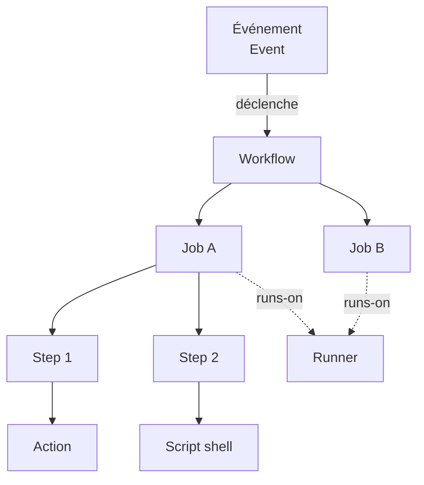

## Qu'est-ce que GitHub Actions ?

GitHub Actions est la plateforme d'**automatisation** intégrée à GitHub. Elle permet d'exécuter des scripts automatiquement en réponse à des événements qui se produisent dans un dépôt Git : un push, l'ouverture d'une pull request, la création d'un tag, une release, ou même un déclenchement manuel.

En pratique, GitHub Actions sert principalement à :

- **Intégration continue (CI)** : lancer les tests et le lint à chaque push pour détecter les régressions immédiatement.
- **Déploiement continu (CD)** : livrer automatiquement une nouvelle version en production après validation.
- **Automatisation des tâches répétitives** : générer de la documentation, mettre à jour des dépendances, publier des packages, notifier une équipe.

## Pourquoi GitHub Actions plutôt qu'un autre outil ?

Il existe de nombreux outils de CI/CD : Jenkins, CircleCI, GitLab CI, Travis CI, etc. GitHub Actions se distingue par plusieurs avantages :

- **Intégration native** : le workflow est défini dans le dépôt lui-même, versionné avec le code.
- **Marketplace** : des milliers d'actions prêtes à l'emploi couvrent la quasi-totalité des besoins courants.
- **Runners hébergés** : GitHub fournit des machines virtuelles gratuitement (dans une certaine limite) sans infrastructure à gérer.
- **Self-hosted runners** : on peut brancher ses propres machines ou clusters Kubernetes pour des cas d'usage avancés.
- **Gratuit pour les repos publics** : illimité pour les projets open source.

## Les concepts clés

Avant d'écrire la moindre ligne de YAML, il faut assimiler le vocabulaire de base. Tout s'articule autour de cinq notions.



### Événement (Event)

Un événement est ce qui déclenche un workflow. GitHub émet des événements pour pratiquement tout ce qui se passe dans un dépôt :

- `push` : un commit est poussé sur une branche
- `pull_request` : une PR est ouverte, mise à jour, fermée
- `release` : une release est publiée
- `schedule` : déclenchement programmé (cron)
- `workflow_dispatch` : déclenchement manuel via l'interface GitHub
- Et une cinquantaine d'autres...

### Workflow

Un workflow est un **processus automatisé** défini dans un fichier YAML. Il est stocké dans le dépôt sous `.github/workflows/nom-du-workflow.yml`. Un dépôt peut avoir autant de workflows que nécessaire.

Un workflow :
- réagit à un ou plusieurs événements
- contient un ou plusieurs jobs
- s'exécute entièrement sur un runner

### Job

Un job est un **ensemble d'étapes** qui s'exécutent séquentiellement sur le **même runner**. Par défaut, les jobs d'un même workflow s'exécutent **en parallèle**. On peut définir des dépendances entre jobs (`needs`) pour les forcer à s'exécuter dans un ordre précis.

### Step (étape)

Une étape est la plus petite unité d'un workflow. Chaque étape est soit :

- une **action** : une unité de code réutilisable (provenant du marketplace ou définie localement)
- une **commande shell** : un script `run:` exécuté directement dans le terminal du runner

Les étapes d'un job partagent le même filesystem et les mêmes variables d'environnement.

### Runner

Un runner est la **machine virtuelle** (ou le conteneur) qui exécute les jobs. GitHub propose des runners hébergés pour Linux, Windows et macOS. Il est aussi possible d'utiliser ses propres machines (self-hosted runners) — nous y consacrerons toute une partie de ce guide.

## Le projet fil rouge : `demo-api`

Tout au long de ce guide, nous allons construire les pipelines CI/CD d'une application concrète : **`demo-api`**, une API REST minimaliste en Python (FastAPI) avec quelques endpoints et une suite de tests.

Le projet est simple volontairement — l'objectif n'est pas d'apprendre FastAPI, mais de se concentrer sur GitHub Actions. À la fin du guide, `demo-api` disposera :

- d'une CI complète (lint, tests, couverture de code)
- d'une chaîne de build et publication d'image Docker
- d'un déploiement automatique sur un cluster Kubernetes
- de runners auto-hébergés pour les tâches sensibles

Voici la structure du projet que nous utiliserons :

```
demo-api/
├── .github/
│   └── workflows/         ← nos fichiers de workflow
├── app/
│   ├── main.py            ← application FastAPI
│   └── routers/
│       └── items.py
├── tests/
│   ├── test_main.py
│   └── test_items.py
├── Dockerfile
├── requirements.txt
└── requirements-dev.txt
```

> **Note** : dans ce guide, les exercices sur le projet fil rouge s'appuient sur un dépôt GitHub réel. Vous pouvez créer ce dépôt dès maintenant pour suivre les exercices.

> **Exercice** : Créez un dépôt public `demo-api` sur votre compte GitHub. Initialisez-le avec un `README.md`. Naviguez ensuite dans l'onglet **Actions** de ce dépôt et observez l'interface vide qui vous accueille.

<details>
<summary>Solution</summary>

```bash
# Avec GitHub CLI (recommandé)
gh repo create demo-api --public --description "API de démonstration — fil rouge du guide GitHub Actions"

# Ou via l'interface web : github.com/new
```

L'onglet Actions affiche un catalogue d'exemples de workflows. GitHub détecte automatiquement le type de projet et propose des templates adaptés. Pour l'instant, ignorez ces suggestions — nous allons tout écrire à la main pour comprendre la syntaxe.

</details>

## Architecture d'un fichier de workflow

Un workflow est un fichier YAML placé dans `.github/workflows/`. Voici la structure minimale :

```yaml
# .github/workflows/ci.yml
name: CI                   # Nom affiché dans l'interface GitHub

on:                        # Événements déclencheurs
  push:
    branches: [main]

jobs:                      # Définition des jobs
  build:                   # Identifiant du job (libre)
    runs-on: ubuntu-latest # Runner à utiliser
    steps:
      - name: Récupérer le code
        uses: actions/checkout@v4

      - name: Afficher un message
        run: echo "Hello, GitHub Actions !"
```

Chaque section sera détaillée dans les chapitres suivants. Pour l'instant, retenez la hiérarchie : **workflow → jobs → steps**.

## Quotas et facturation

GitHub Actions propose un niveau gratuit généreux :

| Plan        | Minutes incluses/mois | Stockage artifacts |
|-------------|----------------------|-------------------|
| Free        | 2 000 min            | 500 MB            |
| Pro         | 3 000 min            | 1 GB              |
| Team        | 3 000 min            | 2 GB              |
| Enterprise  | 50 000 min           | 50 GB             |

Ces quotas s'appliquent uniquement aux **repos privés**. Les **repos publics** bénéficient de minutes illimitées.

Les multiplicateurs de coût selon le système d'exploitation du runner :

| OS      | Multiplicateur |
|---------|---------------|
| Linux   | ×1            |
| Windows | ×2            |
| macOS   | ×10           |

> En pratique, pour un projet personnel ou une petite équipe utilisant Linux, le plan gratuit est largement suffisant. Les self-hosted runners (que nous verrons en partie 4) ne consomment aucune minute GitHub.
