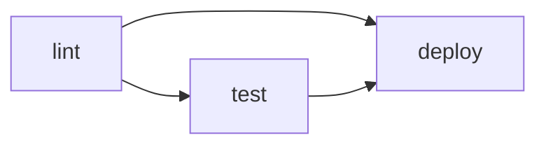

## La syntaxe YAML en contexte GitHub Actions

Un fichier de workflow est du YAML. Si vous n'êtes pas à l'aise avec YAML, retenez les règles essentielles :

- L'**indentation** est significative — utilisez des espaces, jamais des tabulations.
- Les **clés** sont séparées de leurs valeurs par `:`.
- Les **listes** sont préfixées par `-`.
- Les **chaînes** peuvent être écrites avec ou sans guillemets (les guillemets sont nécessaires quand la valeur contient des caractères spéciaux).

## Anatomie complète d'un workflow

```yaml
name: Nom affiché dans l'interface # [1]

on: # [2]
  push:
    branches: [main, develop]
  pull_request:
    branches: [main]

env: # [3]
  APP_NAME: mon-app

jobs: # [4]
  info:
    name: "Informations de run"
    runs-on: ubuntu-latest
    steps:
      - run: echo "Déclenchement sur ${{ github.ref_name }} par ${{ github.actor }}"

  validate:
    name: "Validation"
    runs-on: ubuntu-latest
    needs: info # [5]
    steps:
      - run: echo "✓ $APP_NAME validé"
```

`[1]` **`name`** — nom du workflow, affiché dans l'onglet Actions (optionnel)<br>
`[2]` **`on`** — événements déclencheurs<br>
`[3]` **`env`** — variables d'environnement globales (optionnel)<br>
`[4]` **`jobs`** — liste des jobs à exécuter<br>
`[5]` **`needs`** — dépendance : ce job attend que `lint` soit terminé<br>

Décortiquons chaque section.

## `name` — Le nom du workflow

```yaml
name: CI Pipeline
```

Optionnel mais recommandé. Ce nom apparaît dans l'onglet Actions de GitHub. Sans ce champ, GitHub affiche le chemin du fichier.

## `on` — Les déclencheurs

C'est la section la plus importante. Elle définit quand le workflow s'exécute.

### Déclencher sur un push

```yaml
on:
  push:
    branches:
      - main
      - "release/**" # Wildcard : toutes les branches release/xxx
    tags:
      - "v*" # Tous les tags commençant par v
    paths:
      - "src/**" # Seulement si des fichiers sous src/ ont changé
      - "!docs/**" # Sauf les fichiers sous docs/
```

Le filtrage par `paths` est très utile dans un monorepo : on ne déclenche le pipeline d'une application que si son code a réellement changé.

### Déclencher sur une pull request

```yaml
on:
  pull_request:
    branches: [main]
    types: [opened, synchronize, reopened]
```

Les types disponibles pour `pull_request` incluent : `opened`, `closed`, `merged`, `synchronize` (nouveau commit poussé), `labeled`, `review_requested`, etc.

### Déclenchement planifié (cron)

```yaml
on:
  schedule:
    - cron: "0 8 * * 1-5" # Tous les jours de semaine à 8h UTC
```

La syntaxe cron standard : `minute heure jour-du-mois mois jour-de-semaine`.

### Déclenchement manuel

```yaml
on:
  workflow_dispatch:
    inputs:
      environment:
        description: "Environnement cible"
        required: true
        default: "staging"
        type: choice
        options: [staging, production]
```

Avec `workflow_dispatch`, un bouton "Run workflow" apparaît dans l'interface GitHub. Les `inputs` permettent de passer des paramètres.

### Plusieurs événements simultanés

```yaml
on: [push, pull_request]   # Syntaxe courte

# Ou syntaxe longue pour filtrer finement :
on:
  push:
    branches: [main]
  pull_request:
    branches: [main]
  workflow_dispatch:
```

## `env` — Variables d'environnement globales

```yaml
env:
  APP_VERSION: "1.0.0"
  APP_NAME: mon-app
```

Ces variables sont disponibles dans **tous les jobs et toutes les steps** du workflow. On peut aussi définir des variables au niveau d'un job ou d'une step — les niveaux plus précis écrasent les niveaux supérieurs.

## `jobs` — Les jobs

Un job minimal :

```yaml
jobs:
  mon-job:
    runs-on: ubuntu-latest
    steps:
      - run: echo "Hello"
```

### `runs-on` — Choisir le runner

GitHub fournit des runners hébergés avec plusieurs systèmes :

| Label            | OS             | Architecture |
| ---------------- | -------------- | ------------ |
| `ubuntu-latest`  | Ubuntu 24.04   | x64          |
| `ubuntu-22.04`   | Ubuntu 22.04   | x64          |
| `windows-latest` | Windows Server | x64          |
| `macos-latest`   | macOS 15       | ARM64        |
| `macos-13`       | macOS 13       | x64          |

> Recommandation : utilisez `ubuntu-latest` par défaut. C'est le plus rapide, le moins coûteux (×1) et le plus courant dans les exemples de la communauté.

### Les steps — commandes shell et actions

Une step est soit une **commande shell** (`run`), soit une **action réutilisable** (`uses`) :

```yaml
steps:
  # Commande shell simple
  - name: Afficher la version Python
    run: python3 --version

  # Commande multi-lignes (syntaxe | : préserve les retours à la ligne)
  - name: Inspecter l'environnement
    run: |
      echo "OS     : $(uname -s)"
      echo "Python : $(python3 --version)"
      echo "Docker : $(docker --version)"

  # Commande avec variable d'environnement locale à la step
  - name: Build avec une variable
    env:
      BUILD_ENV: production
    run: echo "Build pour $BUILD_ENV"
```

> Les steps peuvent aussi utiliser des **actions** (`uses`) — des briques réutilisables publiées sur le Marketplace. C'est l'objet du chapitre suivant.

### `needs` — Dépendances entre jobs

Par défaut, tous les jobs d'un workflow s'exécutent **en parallèle**. Pour les séquencer :

```yaml
jobs:
  lint:
    runs-on: ubuntu-latest
    steps:
      - run: echo "lint"

  test:
    runs-on: ubuntu-latest
    needs: lint # Test attend que lint soit terminé
    steps:
      - run: echo "test"

  deploy:
    runs-on: ubuntu-latest
    needs: [lint, test] # Deploy attend lint ET test
    steps:
      - run: echo "deploy"
```



## Les runners hébergés — ce qui est pré-installé

Les runners GitHub viennent avec un environnement riche. Sur `ubuntu-latest` on trouve notamment :

- Docker, Docker Compose
- Git, GitHub CLI (`gh`)
- Node.js (plusieurs versions via `nvm`)
- Python (plusieurs versions)
- Java, Go, Ruby, .NET
- `curl`, `wget`, `jq`, `yq`
- AWS CLI, Azure CLI, Google Cloud SDK

La liste complète est disponible dans le [dépôt `actions/runner-images`](https://github.com/actions/runner-images).

## Premier workflow concret : `mon-app`

Mettons en pratique. Ce premier workflow ne fait pas encore de CI à proprement parler — il n'a pas encore accès au code du dépôt (cela vient au chapitre suivant). L'objectif est de maîtriser la structure : déclencheurs, jobs, dépendances, variables d'environnement, commandes shell.

Les runners GitHub viennent avec un environnement riche pré-installé. On peut s'en servir dès ce premier workflow pour afficher des informations utiles et valider l'environnement de build.

> **Exercice** : Créez le fichier `.github/workflows/ci.yml` dans le dépôt `mon-app`. Ce workflow doit :
>
> 1. Se déclencher sur tout push vers `main` et sur toute pull request vers `main`.
> 2. Déclarer une variable d'environnement globale `IMAGE_NAME` à `"mon-app"`.
> 3. Contenir un job `info` sur `ubuntu-latest` qui affiche sur trois lignes séparées : l'événement déclencheur (`github.event_name`), la branche (`github.ref_name`) et l'auteur du commit (`github.actor`).
> 4. Contenir un second job `check` qui dépend de `info` et affiche le nom de l'image cible (via `IMAGE_NAME`), la version de Docker et la version de Docker Buildx disponibles sur le runner.

<details>
<summary>Solution</summary>

```yaml
# .github/workflows/ci.yml
name: CI

on:
  push:
    branches: [main]
  pull_request:
    branches: [main]

env:
  IMAGE_NAME: mon-app

jobs:
  info:
    name: "Informations de run"
    runs-on: ubuntu-latest
    steps:
      - name: Contexte du déclenchement
        run: |
          echo "Événement : ${{ github.event_name }}"
          echo "Branche   : ${{ github.ref_name }}"
          echo "Auteur    : ${{ github.actor }}"

  check:
    name: "Vérification de l'environnement"
    runs-on: ubuntu-latest
    needs: info
    steps:
      - name: Outils disponibles
        run: |
          echo "Image cible : $IMAGE_NAME"
          echo "Docker      : $(docker --version)"
          echo "Buildx      : $(docker buildx version)"
```

Points importants :

- `${{ github.event_name }}` et les autres expressions sont des **variables de contexte** — GitHub Actions les remplace par leurs valeurs réelles au moment de l'exécution.
- `$IMAGE_NAME` est la variable d'environnement globale définie sous `env:` — disponible dans tous les jobs et toutes les steps.
- Le job `check` ne démarre qu'une fois `info` terminé avec succès grâce à `needs: info`.
- Docker et Docker Buildx sont pré-installés sur `ubuntu-latest` — pas besoin de les configurer à ce stade.

</details>

## Visualiser les résultats dans GitHub

Après avoir poussé ce fichier, naviguez dans l'onglet **Actions** de votre dépôt. Vous verrez :

1. La liste des exécutions passées (chaque push crée une nouvelle ligne).
2. En cliquant sur une exécution : la liste des jobs.
3. En cliquant sur un job : le détail de chaque step avec les logs.

Les étapes marquées d'une coche verte ont réussi. Une croix rouge indique un échec — cliquer dessus affiche les logs d'erreur.

## Re-run et débogage

Si un workflow échoue, vous pouvez :

- **Re-run all jobs** : relancer tous les jobs depuis le début.
- **Re-run failed jobs** : relancer uniquement les jobs qui ont échoué (disponible si au moins un job a réussi).
- **Enable debug logging** : ajouter le secret `ACTIONS_STEP_DEBUG` à la valeur `true` dans les paramètres du dépôt pour obtenir des logs ultra-détaillés.
