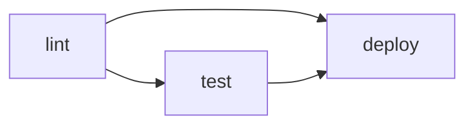

## La syntaxe YAML en contexte GitHub Actions

Un fichier de workflow est du YAML. Si vous n'êtes pas à l'aise avec YAML, retenez les règles essentielles :

- L'**indentation** est significative — utilisez des espaces, jamais des tabulations.
- Les **clés** sont séparées de leurs valeurs par `: `.
- Les **listes** sont préfixées par `- `.
- Les **chaînes** peuvent être écrites avec ou sans guillemets (les guillemets sont nécessaires quand la valeur contient des caractères spéciaux).

## Anatomie complète d'un workflow

```yaml
name: Nom affiché dans l'interface            # ① Nom du workflow (optionnel)

on:                                            # ② Événements déclencheurs
  push:
    branches: [main, develop]
  pull_request:
    branches: [main]

env:                                           # ③ Variables d'environnement globales (optionnel)
  NODE_VERSION: "20"

jobs:                                          # ④ Jobs
  lint:                                        #    Identifiant du job
    name: "Vérification du style"              #    Nom affiché (optionnel)
    runs-on: ubuntu-latest                     #    Runner
    steps:                                     #    Étapes
      - uses: actions/checkout@v4              #    Action
      - run: npm run lint                      #    Commande shell

  test:
    name: "Tests unitaires"
    runs-on: ubuntu-latest
    needs: lint                                # ⑤ Dépendance : test s'exécute après lint
    steps:
      - uses: actions/checkout@v4
      - run: npm test
```

Décortiquons chaque section.

## ① `name` — Le nom du workflow

```yaml
name: CI Pipeline
```

Optionnel mais recommandé. Ce nom apparaît dans l'onglet Actions de GitHub. Sans ce champ, GitHub affiche le chemin du fichier.

## ② `on` — Les déclencheurs

C'est la section la plus importante. Elle définit quand le workflow s'exécute.

### Déclencher sur un push

```yaml
on:
  push:
    branches:
      - main
      - "release/**"     # Wildcard : toutes les branches release/xxx
    tags:
      - "v*"             # Tous les tags commençant par v
    paths:
      - "src/**"         # Seulement si des fichiers sous src/ ont changé
      - "!docs/**"       # Sauf les fichiers sous docs/
```

Le filtrage par `paths` est très utile dans un monorepo : on ne déclenche le pipeline d'une application que si son code a réellement changé.

### Déclencher sur une pull request

```yaml
on:
  pull_request:
    branches: [main]
    types: [opened, synchronize, reopened]
```

Les types disponibles pour `pull_request` incluent : `opened`, `closed`, `merged`, `synchronize` (nouveau commit poussé), `labeled`, `review_requested`, etc.

### Déclenchement planifié (cron)

```yaml
on:
  schedule:
    - cron: "0 8 * * 1-5"   # Tous les jours de semaine à 8h UTC
```

La syntaxe cron standard : `minute heure jour-du-mois mois jour-de-semaine`.

### Déclenchement manuel

```yaml
on:
  workflow_dispatch:
    inputs:
      environment:
        description: "Environnement cible"
        required: true
        default: "staging"
        type: choice
        options: [staging, production]
```

Avec `workflow_dispatch`, un bouton "Run workflow" apparaît dans l'interface GitHub. Les `inputs` permettent de passer des paramètres.

### Plusieurs événements simultanés

```yaml
on: [push, pull_request]   # Syntaxe courte

# Ou syntaxe longue pour filtrer finement :
on:
  push:
    branches: [main]
  pull_request:
    branches: [main]
  workflow_dispatch:
```

## ③ `env` — Variables d'environnement globales

```yaml
env:
  APP_VERSION: "1.0.0"
  APP_NAME: mon-app
```

Ces variables sont disponibles dans **tous les jobs et toutes les steps** du workflow. On peut aussi définir des variables au niveau d'un job ou d'une step — les niveaux plus précis écrasent les niveaux supérieurs.

## ④ `jobs` — Les jobs

Un job minimal :

```yaml
jobs:
  mon-job:
    runs-on: ubuntu-latest
    steps:
      - run: echo "Hello"
```

### `runs-on` — Choisir le runner

GitHub fournit des runners hébergés avec plusieurs systèmes :

| Label                  | OS              | Architecture |
|------------------------|-----------------|-------------|
| `ubuntu-latest`        | Ubuntu 24.04    | x64         |
| `ubuntu-22.04`         | Ubuntu 22.04    | x64         |
| `windows-latest`       | Windows Server  | x64         |
| `macos-latest`         | macOS 15        | ARM64       |
| `macos-13`             | macOS 13        | x64         |

> Recommandation : utilisez `ubuntu-latest` par défaut. C'est le plus rapide, le moins coûteux (×1) et le plus courant dans les exemples de la communauté.

### Les steps — Actions vs commandes shell

Une step est soit une **action** (`uses`), soit une **commande** (`run`) :

```yaml
steps:
  # Utiliser une action du marketplace
  - name: Cloner le code
    uses: actions/checkout@v4

  # Exécuter une commande shell
  - name: Afficher la version Python
    run: python --version

  # Commande multi-lignes
  - name: Préparer l'environnement
    run: |
      pip install -r requirements.txt
      pip install -r requirements-dev.txt

  # Commande avec variables d'environnement locales à la step
  - name: Build avec une variable
    env:
      BUILD_ENV: production
    run: echo "Build pour $BUILD_ENV"
```

La syntaxe `|` en YAML préserve les retours à la ligne — c'est la façon standard d'écrire des scripts multi-lignes.

### `needs` — Dépendances entre jobs

Par défaut, tous les jobs d'un workflow s'exécutent **en parallèle**. Pour les séquencer :

```yaml
jobs:
  lint:
    runs-on: ubuntu-latest
    steps:
      - run: echo "lint"

  test:
    runs-on: ubuntu-latest
    needs: lint           # Test attend que lint soit terminé
    steps:
      - run: echo "test"

  deploy:
    runs-on: ubuntu-latest
    needs: [lint, test]   # Deploy attend lint ET test
    steps:
      - run: echo "deploy"
```



## Les runners hébergés — ce qui est pré-installé

Les runners GitHub viennent avec un environnement riche. Sur `ubuntu-latest` on trouve notamment :

- Docker, Docker Compose
- Git, GitHub CLI (`gh`)
- Node.js (plusieurs versions via `nvm`)
- Python (plusieurs versions)
- Java, Go, Ruby, .NET
- `curl`, `wget`, `jq`, `yq`
- AWS CLI, Azure CLI, Google Cloud SDK

La liste complète est disponible dans le [dépôt `actions/runner-images`](https://github.com/actions/runner-images).

## Premier workflow concret : `mon-app`

Mettons en pratique. Voici le workflow CI minimal pour `mon-app` — il vérifie que le projet se build correctement à chaque push. C'est la base sur laquelle nous construirons les pipelines lint+test dans les chapitres suivants.

Le principe : **si le `docker build` réussit, l'image est valide**. C'est un premier filet de sécurité universel, indépendant du langage.

> **Exercice** : Créez le fichier `.github/workflows/ci.yml` dans le dépôt `mon-app`. Ce workflow doit :
> 1. Se déclencher sur tout push vers `main` et sur toute pull request vers `main`.
> 2. Exécuter un seul job `build` sur `ubuntu-latest`.
> 3. Récupérer le code avec `actions/checkout@v4`.
> 4. Configurer Docker Buildx (indice : action `docker/setup-buildx-action@v3`).
> 5. Construire l'image Docker sans la pousser.

<details>
<summary>Solution</summary>

```yaml
# .github/workflows/ci.yml
name: CI

on:
  push:
    branches: [main]
  pull_request:
    branches: [main]

jobs:
  build:
    runs-on: ubuntu-latest
    steps:
      - name: Cloner le code
        uses: actions/checkout@v4

      - name: Configurer Docker Buildx
        uses: docker/setup-buildx-action@v3

      - name: Vérifier que l'image se build
        uses: docker/build-push-action@v6
        with:
          context: .
          push: false          # Build local uniquement — pas de push sur un registry
          cache-from: type=gha
          cache-to: type=gha,mode=max
```

Points importants :

- `actions/checkout@v4` est indispensable — sans lui, le runner démarre avec un répertoire de travail vide.
- `docker/setup-buildx-action@v3` active BuildKit, qui apporte le cache de build et le support multi-arch.
- `push: false` build l'image localement sans la publier — parfait pour valider que le `Dockerfile` est correct.
- `cache-from/cache-to: type=gha` met en cache les layers Docker entre les runs pour accélérer les builds suivants.

</details>

## Visualiser les résultats dans GitHub

Après avoir poussé ce fichier, naviguez dans l'onglet **Actions** de votre dépôt. Vous verrez :

1. La liste des exécutions passées (chaque push crée une nouvelle ligne).
2. En cliquant sur une exécution : la liste des jobs.
3. En cliquant sur un job : le détail de chaque step avec les logs.

Les étapes marquées d'une coche verte ont réussi. Une croix rouge indique un échec — cliquer dessus affiche les logs d'erreur.

## Re-run et débogage

Si un workflow échoue, vous pouvez :

- **Re-run all jobs** : relancer tous les jobs depuis le début.
- **Re-run failed jobs** : relancer uniquement les jobs qui ont échoué (disponible si au moins un job a réussi).
- **Enable debug logging** : ajouter le secret `ACTIONS_STEP_DEBUG` à la valeur `true` dans les paramètres du dépôt pour obtenir des logs ultra-détaillés.
