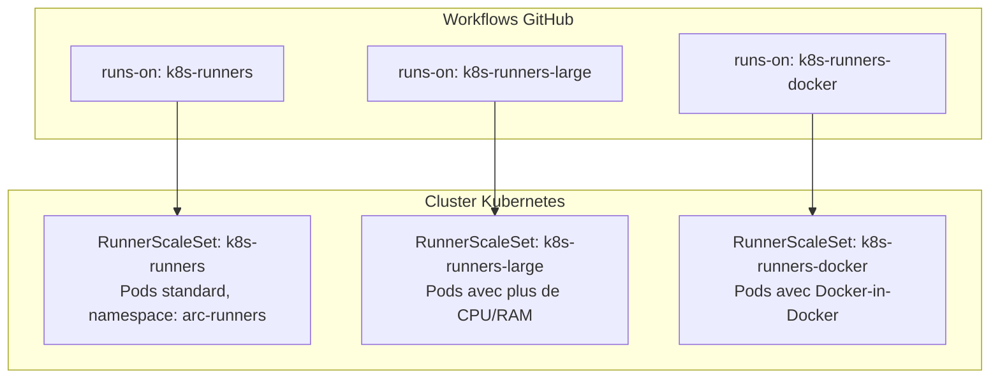

## Plusieurs pools de runners

Il est possible (et recommandé) d'avoir plusieurs RunnerScaleSets pour des besoins différents :



```bash
# Installer un second pool avec plus de ressources
helm install arc-runner-set-large \
  --namespace arc-runners \
  --set githubConfigUrl="https://github.com/MON-ORG" \
  --set githubConfigSecret=arc-github-app-secret \
  --set runnerScaleSetName="k8s-runners-large" \
  --set minRunners=0 \
  --set maxRunners=3 \
  --set "template.spec.containers[0].name=runner" \
  --set "template.spec.containers[0].image=ghcr.io/actions/actions-runner:latest" \
  --set "template.spec.containers[0].resources.requests.cpu=2" \
  --set "template.spec.containers[0].resources.requests.memory=4Gi" \
  --set "template.spec.containers[0].resources.limits.cpu=8" \
  --set "template.spec.containers[0].resources.limits.memory=16Gi" \
  oci://ghcr.io/actions/actions-runner-controller-charts/gha-runner-scale-set
```

## Docker-in-Docker (DinD) pour les builds Docker

Les runners ARC standard n't ont pas accès à Docker. Pour builder des images Docker dans les workflows, il faut configurer **Docker-in-Docker (DinD)** ou **Kaniko**.

### Approche 1 : Docker-in-Docker (DinD)

Le pod runner contient deux conteneurs : le runner et un démon Docker.

```yaml
# arc-runner-dind-values.yaml
githubConfigUrl: "https://github.com/MON-ORG"
githubConfigSecret: arc-github-app-secret
runnerScaleSetName: "k8s-runners-docker"
minRunners: 0
maxRunners: 5

template:
  spec:
    initContainers:
      - name: init-dind-externals
        image: ghcr.io/actions/actions-runner:latest
        command:
          - cp
          - -r
          - /home/runner/externals/.
          - /home/runner/tmpDir/
        volumeMounts:
          - name: dind-externals
            mountPath: /home/runner/tmpDir

    containers:
      # Conteneur principal : le runner GitHub Actions
      - name: runner
        image: ghcr.io/actions/actions-runner:latest
        command: ["/home/runner/run.sh"]
        env:
          - name: DOCKER_HOST
            value: unix:///var/run/docker.sock
        volumeMounts:
          - name: work
            mountPath: /home/runner/_work
          - name: dind-sock
            mountPath: /var/run
          - name: dind-externals
            mountPath: /home/runner/externals
        resources:
          requests:
            cpu: "500m"
            memory: "512Mi"
          limits:
            cpu: "2"
            memory: "4Gi"

      # Conteneur sidecar : le démon Docker
      - name: dind
        image: docker:26-dind
        securityContext:
          privileged: true            # DinD requiert des droits privilégiés
        volumeMounts:
          - name: work
            mountPath: /home/runner/_work
          - name: dind-sock
            mountPath: /var/run
          - name: dind-externals
            mountPath: /home/runner/externals
        resources:
          requests:
            cpu: "500m"
            memory: "512Mi"
          limits:
            cpu: "4"
            memory: "8Gi"

    volumes:
      - name: work
        emptyDir: {}
      - name: dind-sock
        emptyDir: {}
      - name: dind-externals
        emptyDir: {}
```

> **Note sécurité** : `privileged: true` sur le conteneur DinD est une concession sécuritaire. Le pod a accès au kernel du nœud. Mitigation : limitez ces pods à un namespace dédié avec des NetworkPolicies strictes.

### Approche 2 : Kaniko (sans Docker démon)

[Kaniko](https://github.com/GoogleContainerTools/kaniko) build des images Docker sans nécessiter de démon Docker ni de droits privilégiés :

```yaml
      - name: Build avec Kaniko
        uses: int128/kaniko-action@v1
        with:
          push: true
          tags: ghcr.io/${{ github.repository }}:latest
          build-args: |
            APP_VERSION=${{ github.sha }}
          cache: true
          cache-repository: ghcr.io/${{ github.repository }}/cache
```

Kaniko s'exécute comme un conteneur init dans le pod — plus sécurisé que DinD mais plus limité (pas de `docker run` interactif).

## Accès aux ressources Kubernetes depuis les runners

Un cas d'usage courant : le runner doit déployer sur le même cluster (ou un cluster interne). Deux approches :

### Approche 1 : ServiceAccount Kubernetes

Attachez un ServiceAccount au pod runner et configurez RBAC pour lui donner les droits nécessaires :

```yaml
# rbac.yaml
apiVersion: v1
kind: ServiceAccount
metadata:
  name: arc-runner-deployer
  namespace: arc-runners
---
apiVersion: rbac.authorization.k8s.io/v1
kind: ClusterRole
metadata:
  name: arc-runner-deployer
rules:
  - apiGroups: ["apps"]
    resources: ["deployments"]
    verbs: ["get", "list", "update", "patch"]
  - apiGroups: [""]
    resources: ["services", "configmaps"]
    verbs: ["get", "list", "create", "update", "patch"]
---
apiVersion: rbac.authorization.k8s.io/v1
kind: ClusterRoleBinding
metadata:
  name: arc-runner-deployer
subjects:
  - kind: ServiceAccount
    name: arc-runner-deployer
    namespace: arc-runners
roleRef:
  kind: ClusterRole
  name: arc-runner-deployer
  apiGroup: rbac.authorization.k8s.io
```

```bash
kubectl apply -f rbac.yaml
```

Dans le values.yaml du RunnerScaleSet :

```yaml
template:
  spec:
    serviceAccountName: arc-runner-deployer    # Attacher le ServiceAccount

    containers:
      - name: runner
        image: ghcr.io/actions/actions-runner:latest
        command: ["/home/runner/run.sh"]
        # kubectl est déjà dans l'image ARC
        # Il utilisera automatiquement le ServiceAccount du pod
```

Dans le workflow :

```yaml
jobs:
  deploy:
    runs-on: k8s-runners
    steps:
      - uses: actions/checkout@v4
      - run: |
          # kubectl utilise automatiquement le token du ServiceAccount
          kubectl set image deployment/mon-app \
            mon-app=ghcr.io/mon-org/mon-app:${{ github.sha }} \
            -n apps
          kubectl rollout status deployment/mon-app -n apps
```

### Approche 2 : kubeconfig dans les secrets GitHub

```yaml
jobs:
  deploy:
    runs-on: k8s-runners
    steps:
      - uses: actions/checkout@v4

      - name: Configurer kubectl
        run: |
          mkdir -p ~/.kube
          echo "${{ secrets.KUBECONFIG }}" | base64 -d > ~/.kube/config
          chmod 600 ~/.kube/config

      - run: kubectl get pods -n apps
```

L'approche ServiceAccount est préférable : le kubeconfig n'est jamais exposé en dehors du cluster.

## Images de runners personnalisées

L'image `ghcr.io/actions/actions-runner:latest` est minimaliste. Pour des workflows complexes, on crée une image personnalisée qui pré-installe les outils nécessaires :

```dockerfile
# Dockerfile.runner
FROM ghcr.io/actions/actions-runner:latest

USER root

# Installer les outils nécessaires
RUN apt-get update && apt-get install -y \
    kubectl \
    helm \
    python3.12 \
    python3-pip \
    jq \
    && rm -rf /var/lib/apt/lists/*

# Installer des outils Python globaux
RUN pip3 install --no-cache-dir \
    awscli \
    google-cloud-sdk

USER runner
```

Build et push de l'image :

```bash
docker build -f Dockerfile.runner -t ghcr.io/mon-org/arc-runner:latest .
docker push ghcr.io/mon-org/arc-runner:latest
```

Dans le values.yaml :

```yaml
template:
  spec:
    containers:
      - name: runner
        image: ghcr.io/mon-org/arc-runner:latest  # Image personnalisée
        command: ["/home/runner/run.sh"]
```

## Persistance entre les steps : volumes partagés

Dans une configuration DinD ou multi-conteneurs, les steps partagent le même répertoire de travail (`/home/runner/_work`). Pour partager des données entre les conteneurs :

```yaml
    volumes:
      - name: shared-data
        emptyDir: {}

    containers:
      - name: runner
        volumeMounts:
          - name: shared-data
            mountPath: /shared
      - name: helper
        volumeMounts:
          - name: shared-data
            mountPath: /shared
```

## Scaling fin avec les métriques

ARC supporte le scaling basé sur les métriques Kubernetes (KEDA optionnel). Par défaut, il utilise l'API GitHub pour savoir combien de jobs sont en attente.

Paramètres de scaling dans `values.yaml` :

```yaml
minRunners: 0          # Scale to zero en l'absence de jobs
maxRunners: 20         # Limite absolue

# Délai avant de supprimer un runner inactif
# (laisse du temps pour les jobs rapides consécutifs)
# Ces valeurs sont configurées dans le controller, pas ici
```

Mise à jour d'une installation ARC existante :

```bash
helm upgrade arc-runner-set \
  --namespace arc-runners \
  --reuse-values \
  --set maxRunners=20 \
  oci://ghcr.io/actions/actions-runner-controller-charts/gha-runner-scale-set
```

> **Exercice** : Créez un second RunnerScaleSet nommé `k8s-runners-docker` avec la configuration DinD. Modifiez le workflow `docker.yml` de `mon-app` pour l'utiliser à la place de `ubuntu-latest` pour le build Docker.

<details>
<summary>Solution</summary>

```bash
# Créer le fichier de valeurs DinD
cat > arc-runner-dind-values.yaml <<'EOF'
githubConfigUrl: "https://github.com/MON-ORG"
githubConfigSecret: arc-github-app-secret
runnerScaleSetName: "k8s-runners-docker"
minRunners: 0
maxRunners: 3

template:
  spec:
    initContainers:
      - name: init-dind-externals
        image: ghcr.io/actions/actions-runner:latest
        command: ["cp", "-r", "/home/runner/externals/.", "/home/runner/tmpDir/"]
        volumeMounts:
          - name: dind-externals
            mountPath: /home/runner/tmpDir
    containers:
      - name: runner
        image: ghcr.io/actions/actions-runner:latest
        command: ["/home/runner/run.sh"]
        env:
          - name: DOCKER_HOST
            value: unix:///var/run/docker.sock
        volumeMounts:
          - name: work
            mountPath: /home/runner/_work
          - name: dind-sock
            mountPath: /var/run
          - name: dind-externals
            mountPath: /home/runner/externals
        resources:
          requests:
            cpu: "500m"
            memory: "512Mi"
          limits:
            cpu: "2"
            memory: "4Gi"
      - name: dind
        image: docker:26-dind
        securityContext:
          privileged: true
        volumeMounts:
          - name: work
            mountPath: /home/runner/_work
          - name: dind-sock
            mountPath: /var/run
          - name: dind-externals
            mountPath: /home/runner/externals
        resources:
          requests:
            cpu: "500m"
            memory: "512Mi"
    volumes:
      - name: work
        emptyDir: {}
      - name: dind-sock
        emptyDir: {}
      - name: dind-externals
        emptyDir: {}
EOF

helm install arc-runner-set-docker \
  --namespace arc-runners \
  --values arc-runner-dind-values.yaml \
  oci://ghcr.io/actions/actions-runner-controller-charts/gha-runner-scale-set
```

Dans le workflow `docker.yml`, remplacez `ubuntu-latest` par `k8s-runners-docker` :

```yaml
jobs:
  build-push:
    runs-on: k8s-runners-docker    # Au lieu de ubuntu-latest
    steps:
      # Le reste du workflow est identique
```

</details>
