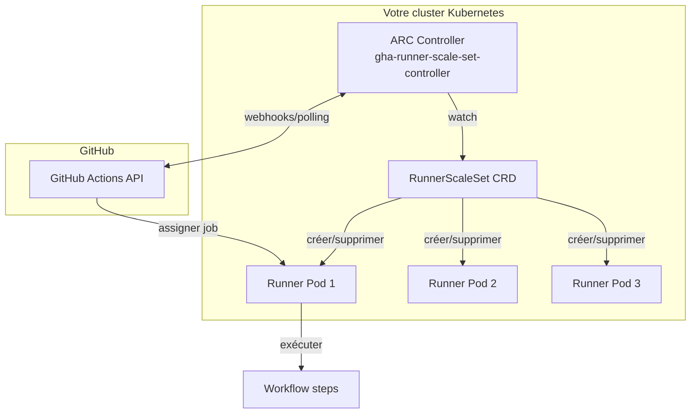

## Qu'est-ce qu'ARC ?

**Actions Runner Controller (ARC)** est un opérateur Kubernetes officiel maintenu par GitHub. Il gère automatiquement le cycle de vie des runners GitHub Actions sur un cluster Kubernetes :

- **Scale-up** : crée de nouveaux pods runners quand des jobs sont en attente.
- **Scale-down** : supprime les pods quand il n'y a pas de travail.
- **Éphémère par défaut** : chaque pod ne traite qu'un seul job puis se termine.
- **Mise à jour automatique** : les runners sont toujours à la dernière version.



## Prérequis

- Cluster Kubernetes >= 1.25 (k3s, k8s, GKE, EKS, AKS...)
- `kubectl` configuré et pointant vers le cluster
- `helm` >= 3.x installé
- Un compte GitHub avec les droits pour créer des GitHub Apps ou des Personal Access Tokens

## Authentification : GitHub App vs PAT

ARC a besoin de s'authentifier auprès de GitHub pour :

1. S'enregistrer comme runner
2. Récupérer les jobs disponibles
3. Rapporter les résultats

### Option 1 : GitHub App (recommandé)

Une GitHub App offre plus de sécurité et de flexibilité qu'un PAT :

- Permissions granulaires
- Pas de durée d'expiration
- Installable sur une organisation entière
- Audit trail par application

**Créer la GitHub App :**

1. Allez sur **github.com/settings/apps/new** (compte personnel) ou **github.com/organizations/MON-ORG/settings/apps/new** (organisation).
2. Remplissez :
   - **App name** : `arc-runner-controller-monnom`
   - **Homepage URL** : URL de votre cluster ou `https://github.com/actions/actions-runner-controller`
   - **Webhook** : désactivé (ARC utilise le polling)
3. **Permissions** (Repository) :
   - Administration : **Read & Write**
4. **Permissions** (Organization) :
   - Self-hosted runners : **Read & Write**
5. Cliquez sur **Create GitHub App**.
6. Sur la page de l'app : notez l'**App ID**.
7. Dans la section **Private keys** : générez et téléchargez une clé privée `.pem`.
8. Sur la page de l'app, cliquez **Install App** → installez sur votre organisation ou vos dépôts.

### Option 2 : Personal Access Token (PAT)

Plus simple pour un usage personnel, mais moins recommandé en production :

1. **github.com/settings/tokens** → Generate new token (classic)
2. Scopes nécessaires :
   - `repo` (accès complet aux dépôts privés)
   - `admin:org` → `manage_runners:org` (gérer les runners d'organisation)
3. Sauvegardez le token — il ne sera plus affiché ensuite.

## Installation d'ARC avec Helm

### Étape 1 — Créer le namespace

```bash
kubectl create namespace arc-systems
```

### Étape 2 — Installer le contrôleur ARC

```bash
helm install arc \
  --namespace arc-systems \
  --create-namespace \
  oci://ghcr.io/actions/actions-runner-controller-charts/gha-runner-scale-set-controller
```

Vérifier que le contrôleur est bien démarré :

```bash
kubectl get pods -n arc-systems
# NAME                                           READY   STATUS    RESTARTS   AGE
# arc-gha-runner-scale-set-controller-xxx-yyy   1/1     Running   0          30s
```

### Étape 3 — Créer le secret d'authentification

**Avec une GitHub App :**

```bash
# Stocker la clé privée dans un secret Kubernetes
kubectl create secret generic arc-github-app-secret \
  --namespace arc-runners \
  --from-literal=github_app_id="<APP_ID>" \
  --from-literal=github_app_installation_id="<INSTALLATION_ID>" \
  --from-file=github_app_private_key=./private-key.pem
```

> L'**Installation ID** se trouve dans l'URL après avoir installé l'app : `github.com/organizations/MON-ORG/settings/installations/XXXXX`

**Avec un PAT :**

```bash
kubectl create namespace arc-runners  # Si pas encore créé

kubectl create secret generic arc-runner-pat \
  --namespace arc-runners \
  --from-literal=github_token="ghp_XXXXXXXXXXXXXXXXXXXXXXXXXX"
```

### Étape 4 — Installer un RunnerScaleSet

Un **RunnerScaleSet** est la ressource Kubernetes qui représente un pool de runners. Créez un fichier `values.yaml` :

```yaml
# arc-runner-values.yaml
githubConfigUrl: "https://github.com/MON-ORG" # URL de l'organisation

# Authentification via GitHub App
githubConfigSecret: arc-github-app-secret

# Nom du runner dans GitHub (apparaîtra comme label dans les workflows)
runnerScaleSetName: "k8s-runners"

# Scaling
minRunners: 0 # 0 = scale to zero quand inactif
maxRunners: 10 # Maximum 10 runners simultanés

# Configuration des pods runners
template:
  spec:
    containers:
      - name: runner
        image: ghcr.io/actions/actions-runner:latest
        command: ["/home/runner/run.sh"]
        resources:
          requests:
            cpu: "500m"
            memory: "512Mi"
          limits:
            cpu: "2"
            memory: "2Gi"
```

Installer le RunnerScaleSet :

```bash
kubectl create namespace arc-runners

helm install arc-runner-set \
  --namespace arc-runners \
  --values arc-runner-values.yaml \
  oci://ghcr.io/actions/actions-runner-controller-charts/gha-runner-scale-set
```

### Vérifier l'installation

```bash
# Le runner doit apparaître comme "Online" dans GitHub
# Settings → Actions → Runners → "k8s-runners"

# Vérifier les pods
kubectl get pods -n arc-runners
# Aucun pod pour l'instant (minRunners: 0 = scale to zero)

# Vérifier les CRDs ARC
kubectl get autoscalingrunnersets -n arc-runners
# NAME           ENTERPRISE   ORGANIZATION   REPOSITORY   STATUS
# arc-runner-set              mon-org                     Running
```

## Tester l'installation

```yaml
# .github/workflows/test-arc.yml
name: Test ARC Runner

on:
  workflow_dispatch:

jobs:
  test:
    runs-on: k8s-runners # Nom défini dans runnerScaleSetName
    steps:
      - run: |
          echo "Je tourne sur : $(hostname)"
          echo "Kernel : $(uname -r)"
          kubectl version --client 2>/dev/null || echo "kubectl non disponible"
```

Déclenchement depuis l'interface GitHub → Actions → "Test ARC Runner" → Run workflow.

Pendant l'exécution, observez les pods se créer en temps réel :

```bash
kubectl get pods -n arc-runners --watch
# NAME                              READY   STATUS    RESTARTS   AGE
# arc-runner-set-xxxxx-runner-xxx   0/1     Init:0/1  0          2s
# arc-runner-set-xxxxx-runner-xxx   1/1     Running   0          5s
# arc-runner-set-xxxxx-runner-xxx   0/1     Completed 0          35s
# (le pod disparaît après complétion)
```

Le pod se crée au démarrage du job et se supprime à la fin — c'est le comportement éphémère.

> **Exercice** : Installez ARC sur votre cluster Kubernetes. Créez un RunnerScaleSet nommé `k8s-runners` enregistré sur votre organisation GitHub. Vérifiez que le runner apparaît en "Idle" dans l'interface GitHub. Déclenchez manuellement le workflow de test et observez le pod se créer puis disparaître.

<details>
<summary>Solution</summary>

Commandes complètes dans l'ordre :

```bash
# 1. Installer le contrôleur ARC
helm install arc \
  --namespace arc-systems \
  --create-namespace \
  oci://ghcr.io/actions/actions-runner-controller-charts/gha-runner-scale-set-controller

# 2. Attendre que le contrôleur soit prêt
kubectl rollout status deployment/arc-gha-runner-scale-set-controller -n arc-systems

# 3. Créer le secret PAT (si vous n'utilisez pas la GitHub App)
kubectl create namespace arc-runners
kubectl create secret generic arc-runner-pat \
  --namespace arc-runners \
  --from-literal=github_token="ghp_VOTRE_TOKEN"

# 4. Créer le fichier de valeurs
cat > arc-runner-values.yaml <<'EOF'
githubConfigUrl: "https://github.com/VOTRE_ORG_OU_USER"
githubConfigSecret: arc-runner-pat
runnerScaleSetName: "k8s-runners"
minRunners: 0
maxRunners: 5
template:
  spec:
    containers:
      - name: runner
        image: ghcr.io/actions/actions-runner:latest
        command: ["/home/runner/run.sh"]
        resources:
          requests:
            cpu: "500m"
            memory: "512Mi"
          limits:
            cpu: "2"
            memory: "2Gi"
EOF

# 5. Installer le RunnerScaleSet
helm install arc-runner-set \
  --namespace arc-runners \
  --values arc-runner-values.yaml \
  oci://ghcr.io/actions/actions-runner-controller-charts/gha-runner-scale-set

# 6. Vérifier dans GitHub
# github.com/VOTRE_ORG/settings/actions/runners
# → "k8s-runners" doit apparaître avec le statut "Idle"
```

Si le runner n'apparaît pas, vérifiez les logs du contrôleur :

```bash
kubectl logs -n arc-systems deployment/arc-gha-runner-scale-set-controller
```

Les erreurs d'authentification apparaissent clairement dans ces logs.

</details>
