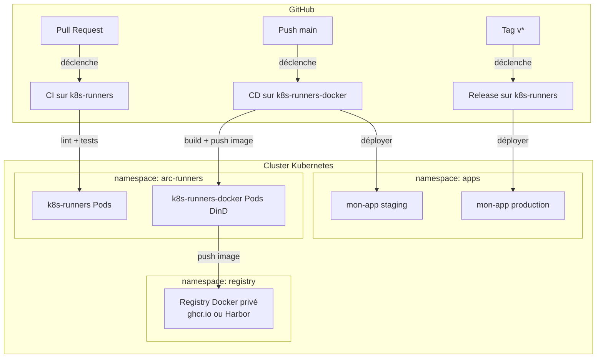
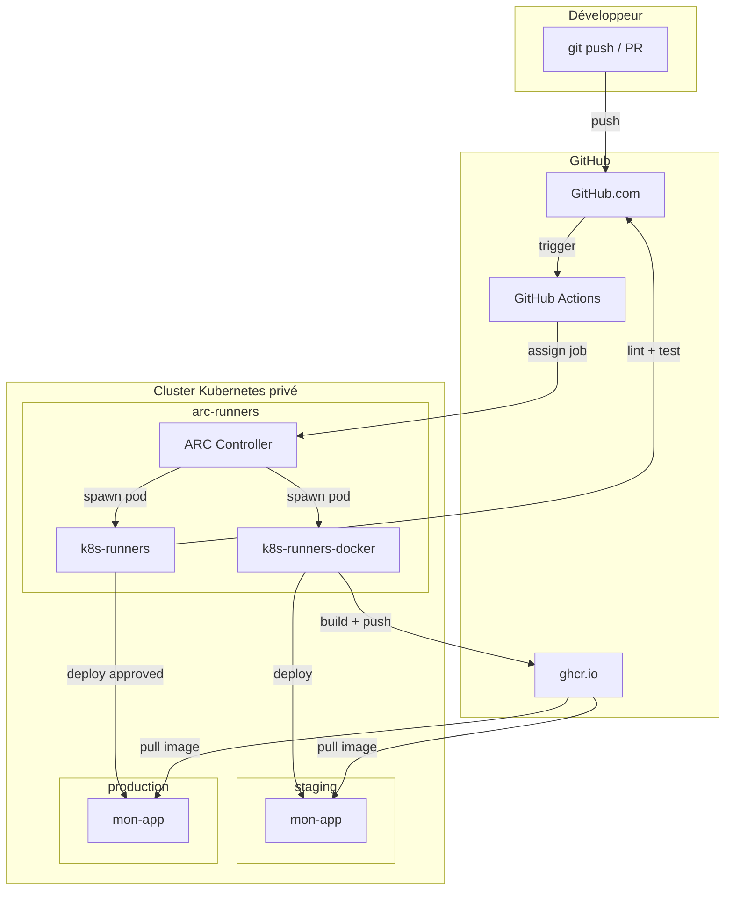

## L'architecture finale

Ce chapitre assemble tout ce que nous avons appris pour construire le pipeline de production de `mon-app`. Ce pipeline tourne **entièrement sur votre cluster Kubernetes privé** et déploie sur ce même cluster.



## Structure finale des workflows

Le projet `mon-app` dispose de trois workflows :

| Fichier                    | Déclencheur            | Runner              | Rôle                              |
|---------------------------|------------------------|---------------------|-----------------------------------|
| `ci.yml`                  | push, pull_request     | `k8s-runners`       | Lint, tests, coverage             |
| `docker.yml`              | push main, tags        | `k8s-runners-docker`| Build, push image, scan           |
| `deploy.yml`              | workflow_call          | `k8s-runners`       | Déploiement sur le cluster        |

## Le workflow CI (`ci.yml`)

```yaml
# .github/workflows/ci.yml
name: CI

on:
  push:
    branches: [main]
  pull_request:
    branches: [main]

permissions:
  contents: read
  pull-requests: write

concurrency:
  group: ci-${{ github.ref }}
  cancel-in-progress: true

jobs:
  lint:
    name: "Lint"
    runs-on: k8s-runners            # Runner privé sur Kubernetes
    steps:
      - uses: actions/checkout@v4

      - uses: actions/setup-python@v5
        with:
          python-version: "3.12"
          cache: pip

      - run: pip install ruff
      - run: ruff check .
      - run: ruff format --check .

  test:
    name: "Tests (Python ${{ matrix.python-version }})"
    runs-on: k8s-runners
    strategy:
      fail-fast: false
      matrix:
        python-version: ["3.11", "3.12"]
    steps:
      - uses: actions/checkout@v4

      - uses: actions/setup-python@v5
        with:
          python-version: ${{ matrix.python-version }}
          cache: pip

      - run: pip install -r requirements.txt -r requirements-dev.txt

      - name: Lancer les tests
        run: pytest --cov=app --cov-report=xml --cov-report=term-missing

      - uses: actions/upload-artifact@v4
        if: always()
        with:
          name: coverage-${{ matrix.python-version }}
          path: coverage.xml

  coverage-pr-comment:
    needs: test
    runs-on: k8s-runners
    if: github.event_name == 'pull_request'
    steps:
      - uses: actions/checkout@v4

      - uses: actions/download-artifact@v4
        with:
          name: coverage-3.12
          path: coverage/

      - uses: py-actions/py-cov-comment@v1
        with:
          github-token: ${{ secrets.GITHUB_TOKEN }}
          coverage-xml-file: coverage/coverage.xml
```

## Le workflow Docker (`docker.yml`)

```yaml
# .github/workflows/docker.yml
name: Docker Build & Deploy

on:
  push:
    branches: [main]
    tags: ["v*"]
  workflow_dispatch:

permissions:
  contents: read
  packages: write
  id-token: write              # Pour OIDC cosign

concurrency:
  group: docker-${{ github.ref }}
  cancel-in-progress: ${{ !startsWith(github.ref, 'refs/tags/') }}

jobs:
  build-push:
    name: "Build & Push"
    runs-on: k8s-runners-docker    # Runner avec Docker-in-Docker
    outputs:
      image-digest: ${{ steps.build.outputs.digest }}
      image-tag: ${{ steps.meta.outputs.version }}
      full-image: ghcr.io/${{ github.repository }}@${{ steps.build.outputs.digest }}

    steps:
      - uses: actions/checkout@v4

      - uses: docker/metadata-action@v5
        id: meta
        with:
          images: ghcr.io/${{ github.repository }}
          tags: |
            type=ref,event=branch
            type=semver,pattern={{version}}
            type=semver,pattern={{major}}.{{minor}}
            type=sha,prefix=,format=short

      - uses: docker/setup-buildx-action@v3

      - uses: docker/login-action@v3
        with:
          registry: ghcr.io
          username: ${{ github.actor }}
          password: ${{ secrets.GITHUB_TOKEN }}

      - uses: docker/build-push-action@v6
        id: build
        with:
          context: .
          platforms: linux/amd64,linux/arm64
          push: true
          tags: ${{ steps.meta.outputs.tags }}
          labels: ${{ steps.meta.outputs.labels }}
          cache-from: type=gha
          cache-to: type=gha,mode=max

  scan:
    name: "Scan de sécurité"
    needs: build-push
    runs-on: k8s-runners
    permissions:
      security-events: write
    steps:
      - uses: aquasecurity/trivy-action@master
        with:
          image-ref: ${{ needs.build-push.outputs.full-image }}
          format: sarif
          output: trivy.sarif
          severity: CRITICAL,HIGH
          ignore-unfixed: true

      - uses: github/codeql-action/upload-sarif@v3
        if: always()
        with:
          sarif_file: trivy.sarif

  sign:
    name: "Signature cosign"
    needs: build-push
    runs-on: k8s-runners
    permissions:
      id-token: write
      packages: write
    steps:
      - uses: sigstore/cosign-installer@v3

      - uses: docker/login-action@v3
        with:
          registry: ghcr.io
          username: ${{ github.actor }}
          password: ${{ secrets.GITHUB_TOKEN }}

      - run: |
          cosign sign --yes ${{ needs.build-push.outputs.full-image }}

  deploy-staging:
    name: "Deploy staging"
    needs: [build-push, scan]
    runs-on: k8s-runners           # Runner avec ServiceAccount kubectl
    environment: staging
    if: github.ref == 'refs/heads/main'
    steps:
      - uses: actions/checkout@v4

      - name: Mettre à jour l'image en staging
        env:
          IMAGE: ghcr.io/${{ github.repository }}@${{ needs.build-push.outputs.image-digest }}
        run: |
          kubectl set image deployment/mon-app mon-app="$IMAGE" -n staging
          kubectl rollout status deployment/mon-app -n staging --timeout=5m

      - name: Smoke test
        run: |
          SERVICE_IP=$(kubectl get svc mon-app -n staging -o jsonpath='{.spec.clusterIP}')
          kubectl run smoke-test --image=curlimages/curl:latest \
            --restart=Never \
            --rm \
            -i \
            --namespace staging \
            -- curl -sf "http://$SERVICE_IP/health"

  deploy-production:
    name: "Deploy production"
    needs: [build-push, deploy-staging]
    runs-on: k8s-runners
    environment: production         # Approbation manuelle requise
    if: startsWith(github.ref, 'refs/tags/v')
    steps:
      - uses: actions/checkout@v4

      - name: Déployer en production
        env:
          IMAGE: ghcr.io/${{ github.repository }}@${{ needs.build-push.outputs.image-digest }}
          VERSION: ${{ needs.build-push.outputs.image-tag }}
        run: |
          kubectl set image deployment/mon-app mon-app="$IMAGE" -n production
          kubectl annotate deployment/mon-app \
            "kubernetes.io/change-cause=Release $VERSION via GitHub Actions run ${{ github.run_id }}" \
            -n production
          kubectl rollout status deployment/mon-app -n production --timeout=10m

  create-release:
    name: "Créer la release GitHub"
    needs: [deploy-production, sign]
    runs-on: k8s-runners
    permissions:
      contents: write
    if: startsWith(github.ref, 'refs/tags/v')
    steps:
      - uses: actions/checkout@v4
        with:
          fetch-depth: 0

      - uses: softprops/action-gh-release@v2
        with:
          generate_release_notes: true
          make_latest: true
          body: |
            ## Image Docker

            ```
            ghcr.io/${{ github.repository }}:${{ needs.build-push.outputs.image-tag }}
            ```

            Digest : `${{ needs.build-push.outputs.image-digest }}`

            Vérifier la signature :
            ```bash
            cosign verify \
              --certificate-identity "https://github.com/${{ github.repository }}/.github/workflows/docker.yml@${{ github.ref }}" \
              --certificate-oidc-issuer "https://token.actions.githubusercontent.com" \
              ghcr.io/${{ github.repository }}:${{ needs.build-push.outputs.image-tag }}
            ```
```

## Les manifestes Kubernetes pour `mon-app`

```yaml
# k8s/namespace.yaml
apiVersion: v1
kind: Namespace
metadata:
  name: staging
---
apiVersion: v1
kind: Namespace
metadata:
  name: production
```

```yaml
# k8s/deployment-staging.yaml
apiVersion: apps/v1
kind: Deployment
metadata:
  name: mon-app
  namespace: staging
spec:
  replicas: 1
  selector:
    matchLabels:
      app: mon-app
  template:
    metadata:
      labels:
        app: mon-app
        version: latest
    spec:
      containers:
        - name: mon-app
          image: ghcr.io/mon-org/mon-app:main
          imagePullPolicy: Always
          ports:
            - containerPort: 8000
          livenessProbe:
            httpGet:
              path: /health
              port: 8000
          readinessProbe:
            httpGet:
              path: /health
              port: 8000
          resources:
            requests:
              cpu: "100m"
              memory: "128Mi"
            limits:
              cpu: "500m"
              memory: "512Mi"
      imagePullSecrets:
        - name: ghcr-pull-secret
```

## Pull secret pour GHCR sur le cluster

Pour que Kubernetes puisse puller les images depuis GHCR (registry privé) :

```bash
# Créer un Personal Access Token avec le scope `read:packages`
# puis créer le secret dans les namespaces concernés

kubectl create secret docker-registry ghcr-pull-secret \
  --docker-server=ghcr.io \
  --docker-username=votre-login \
  --docker-password=ghp_VOTRE_TOKEN \
  --namespace staging

kubectl create secret docker-registry ghcr-pull-secret \
  --docker-server=ghcr.io \
  --docker-username=votre-login \
  --docker-password=ghp_VOTRE_TOKEN \
  --namespace production
```

Pour rendre les images GHCR publiques (plus simple pour usage personnel) :
Sur GitHub → dépôt → Packages → mon-app → Package settings → Change visibility → Public.

## Rollback automatique en cas d'échec

```yaml
      - name: Déployer avec rollback automatique
        run: |
          if ! kubectl rollout status deployment/mon-app -n staging --timeout=5m; then
            echo "Le déploiement a échoué, rollback en cours..."
            kubectl rollout undo deployment/mon-app -n staging
            kubectl rollout status deployment/mon-app -n staging
            echo "Rollback effectué"
            exit 1
          fi
```

## Résumé : Vue d'ensemble de l'écosystème complet



> **Exercice final** : Déployez l'ensemble du pipeline complet. Vérifiez que :
> 1. Une PR déclenche les tests sur `k8s-runners` et affiche un commentaire de coverage.
> 2. Un push sur `main` déclenche le build Docker sur `k8s-runners-docker` et déploie en staging.
> 3. Un tag `v0.2.0` déclenche le déploiement en production après approbation manuelle et crée une release GitHub.
> 4. Un échec de déploiement déclenche un rollback automatique.

<details>
<summary>Solution et checklist de vérification</summary>

**Checklist de préparation :**

```bash
# Namespaces
kubectl create namespace staging
kubectl create namespace production
kubectl create namespace arc-runners

# Pull secrets GHCR (ou rendre les images publiques)
kubectl create secret docker-registry ghcr-pull-secret \
  --docker-server=ghcr.io \
  --docker-username=$GITHUB_LOGIN \
  --docker-password=$GITHUB_PAT \
  --namespace staging
# Répéter pour production

# Manifestes Kubernetes
kubectl apply -f k8s/

# ARC (si pas déjà installé)
helm install arc --namespace arc-systems --create-namespace \
  oci://ghcr.io/actions/actions-runner-controller-charts/gha-runner-scale-set-controller

helm install arc-runner-set --namespace arc-runners \
  --values arc-runner-values.yaml \
  oci://ghcr.io/actions/actions-runner-controller-charts/gha-runner-scale-set

helm install arc-runner-set-docker --namespace arc-runners \
  --values arc-runner-dind-values.yaml \
  oci://ghcr.io/actions/actions-runner-controller-charts/gha-runner-scale-set

# RBAC pour les runners
kubectl apply -f rbac-runner.yaml
```

**Test du pipeline complet :**

```bash
# 1. Créer une PR
git checkout -b feature/final-test
echo "# Test" >> README.md
git add README.md
git commit -m "test: trigger CI pipeline"
git push -u origin feature/final-test
gh pr create --title "test: final pipeline test" --body "Test du pipeline complet"

# 2. Vérifier que CI s'exécute sur k8s-runners
gh run list --workflow=ci.yml
kubectl get pods -n arc-runners --watch

# 3. Merger la PR → déclenche le build Docker
gh pr merge --squash

# 4. Créer un tag de release
git checkout main && git pull
git tag v0.2.0
git push origin v0.2.0

# 5. Approuver le déploiement en production dans l'interface GitHub
# → Actions → run en cours → Review deployments → Approve

# 6. Vérifier la release créée
gh release view v0.2.0
```

</details>

## Conclusion

Vous maîtrisez maintenant l'ensemble de la chaîne GitHub Actions, des fondamentaux jusqu'à l'infrastructure avancée :

- **Les concepts** : workflows, jobs, steps, runners, events
- **Les outils** : actions du marketplace, cache, artifacts, secrets, environnements
- **Les patterns avancés** : matrices, workflows réutilisables, expressions conditionnelles
- **La sécurité** : OIDC, permissions minimales, prévention des injections, supply chain
- **Le CI/CD complet** : lint, tests, build Docker multi-arch, publication GHCR, déploiements sur Kubernetes avec approbation
- **L'infrastructure Kubernetes** : ARC, scaling automatique, DinD, RBAC, NetworkPolicies, hardening

La prochaine étape naturelle est d'explorer **GitOps** avec ArgoCD ou Flux : plutôt que de déployer directement depuis les runners, le workflow met à jour un dépôt de configuration Git et un opérateur GitOps applique les changements de façon autonome et réconciliatoire.
