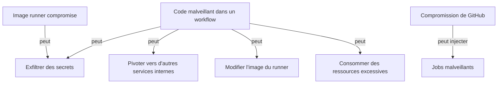

## Modèle de menaces

Avant de sécuriser, on identifie les risques :



Chaque mesure que nous allons mettre en place atténue un ou plusieurs de ces risques.

## NetworkPolicies — Isolation réseau des runners

Par défaut, les pods Kubernetes peuvent communiquer avec n'importe qui dans le cluster. Une **NetworkPolicy** restreint ces communications.

```yaml
# network-policy-runners.yaml
apiVersion: networking.k8s.io/v1
kind: NetworkPolicy
metadata:
  name: arc-runners-network-policy
  namespace: arc-runners
spec:
  podSelector:
    matchLabels:
      actions.github.com/scale-set-name: k8s-runners    # Cibler les pods runners

  policyTypes:
    - Ingress
    - Egress

  ingress:
    # Bloquer tout le trafic entrant (les runners ne reçoivent pas de connexions)
    []

  egress:
    # Autoriser la résolution DNS
    - ports:
        - port: 53
          protocol: UDP
        - port: 53
          protocol: TCP

    # Autoriser HTTPS sortant (GitHub, registries Docker, PyPI...)
    - ports:
        - port: 443
          protocol: TCP
        - port: 80
          protocol: TCP

    # Autoriser la communication avec l'API Kubernetes (pour kubectl)
    - to:
        - ipBlock:
            cidr: 10.0.0.1/32    # IP du kube-apiserver — à adapter
      ports:
        - port: 6443
          protocol: TCP

    # Autoriser la communication avec les services internes spécifiques
    - to:
        - namespaceSelector:
            matchLabels:
              kubernetes.io/metadata.name: apps
        - podSelector:
            matchLabels:
              app: postgres      # Seulement la base de données de test
      ports:
        - port: 5432
```

```bash
kubectl apply -f network-policy-runners.yaml
```

> **Important** : `NetworkPolicy` nécessite un CNI compatible (Calico, Cilium, Weave...). Les CNI basiques (Flannel sans Calico) ne supportent pas les NetworkPolicies.

## PodSecurityContext — Durcissement des pods runners

```yaml
# Dans arc-runner-values.yaml
template:
  spec:
    securityContext:
      runAsNonRoot: true         # Ne jamais tourner en root
      runAsUser: 1001            # UID du user "runner" dans l'image officielle
      runAsGroup: 1001
      fsGroup: 1001
      seccompProfile:
        type: RuntimeDefault     # Profil seccomp par défaut du runtime

    containers:
      - name: runner
        image: ghcr.io/actions/actions-runner:latest
        command: ["/home/runner/run.sh"]
        securityContext:
          allowPrivilegeEscalation: false
          readOnlyRootFilesystem: false  # Le runner a besoin d'écrire dans son home
          capabilities:
            drop:
              - ALL              # Supprimer toutes les capabilities Linux
```

## ResourceQuotas — Limiter la consommation de ressources

Empêchez un workflow de consommer toutes les ressources du cluster :

```yaml
# resource-quota-arc-runners.yaml
apiVersion: v1
kind: ResourceQuota
metadata:
  name: arc-runners-quota
  namespace: arc-runners
spec:
  hard:
    requests.cpu: "20"           # Maximum 20 cœurs cumulés
    requests.memory: 40Gi        # Maximum 40 Gi de RAM cumulés
    limits.cpu: "40"
    limits.memory: 80Gi
    pods: "20"                   # Maximum 20 pods simultanés
    count/services: "10"
---
apiVersion: v1
kind: LimitRange
metadata:
  name: arc-runners-limits
  namespace: arc-runners
spec:
  limits:
    - type: Container
      default:
        cpu: "2"
        memory: 2Gi
      defaultRequest:
        cpu: "500m"
        memory: 512Mi
      max:
        cpu: "8"
        memory: 16Gi
```

```bash
kubectl apply -f resource-quota-arc-runners.yaml
```

## RBAC minimal pour le ServiceAccount runner

Si vos runners ont besoin de deployer sur Kubernetes, ne leur donnez que les permissions strictement nécessaires :

```yaml
# rbac-runner.yaml
apiVersion: v1
kind: ServiceAccount
metadata:
  name: arc-runner
  namespace: arc-runners
---
# Autoriser uniquement la mise à jour des déploiements dans le namespace "apps"
apiVersion: rbac.authorization.k8s.io/v1
kind: Role
metadata:
  name: arc-runner-deployer
  namespace: apps                # Scope: uniquement le namespace apps
rules:
  - apiGroups: ["apps"]
    resources: ["deployments"]
    verbs: ["get", "list", "patch", "update"]
  - apiGroups: [""]
    resources: ["pods"]
    verbs: ["get", "list"]
---
apiVersion: rbac.authorization.k8s.io/v1
kind: RoleBinding
metadata:
  name: arc-runner-deployer
  namespace: apps
subjects:
  - kind: ServiceAccount
    name: arc-runner
    namespace: arc-runners
roleRef:
  kind: Role
  name: arc-runner-deployer
  apiGroup: rbac.authorization.k8s.io
```

```bash
kubectl apply -f rbac-runner.yaml
```

Dans le values.yaml du RunnerScaleSet :

```yaml
template:
  spec:
    serviceAccountName: arc-runner
```

## Imaginez les secrets Kubernetes avec External Secrets

Plutôt que de stocker les tokens GitHub dans des Kubernetes Secrets manuels (qui sont encodés en base64 mais pas chiffrés au repos par défaut), utilisez un gestionnaire de secrets externe :

### Avec Vault (HashiCorp)

```yaml
# vault-external-secret.yaml
apiVersion: external-secrets.io/v1beta1
kind: ExternalSecret
metadata:
  name: arc-github-app-secret
  namespace: arc-runners
spec:
  refreshInterval: 1h
  secretStoreRef:
    name: vault-backend
    kind: ClusterSecretStore
  target:
    name: arc-github-app-secret
    creationPolicy: Owner
  data:
    - secretKey: github_app_id
      remoteRef:
        key: secret/arc/github-app
        property: app_id
    - secretKey: github_app_installation_id
      remoteRef:
        key: secret/arc/github-app
        property: installation_id
    - secretKey: github_app_private_key
      remoteRef:
        key: secret/arc/github-app
        property: private_key
```

### Chiffrement au repos avec Sealed Secrets

Si vous ne disposez pas d'un gestionnaire externe, [Sealed Secrets](https://github.com/bitnami-labs/sealed-secrets) chiffre les secrets Kubernetes avec une clé asymétrique :

```bash
# Installer Sealed Secrets
helm install sealed-secrets \
  --namespace kube-system \
  sealed-secrets/sealed-secrets

# Chiffrer un secret existant
kubectl create secret generic arc-runner-pat \
  --namespace arc-runners \
  --from-literal=github_token="ghp_XXXX" \
  --dry-run=client -o yaml | \
  kubeseal --format yaml > arc-runner-pat-sealed.yaml

# Le fichier arc-runner-pat-sealed.yaml peut être committé dans Git
git add arc-runner-pat-sealed.yaml
git commit -m "chore: add sealed secret for ARC runner PAT"
```

## Mise à jour automatique d'ARC

ARC et ses images de runner reçoivent des mises à jour régulières. Deux stratégies :

### Stratégie 1 : Mise à jour manuelle planifiée

```bash
# Mettre à jour le contrôleur ARC
helm upgrade arc \
  --namespace arc-systems \
  --reuse-values \
  oci://ghcr.io/actions/actions-runner-controller-charts/gha-runner-scale-set-controller

# Mettre à jour les RunnerScaleSets
helm upgrade arc-runner-set \
  --namespace arc-runners \
  --reuse-values \
  oci://ghcr.io/actions/actions-runner-controller-charts/gha-runner-scale-set
```

### Stratégie 2 : Renovate Bot

[Renovate](https://github.com/renovatebot/renovate) est l'équivalent de Dependabot mais plus configurable. Il détecte les nouvelles versions des charts Helm et crée des PRs automatiques.

```json
// renovate.json (dans le repo de configuration GitOps)
{
  "extends": ["config:recommended"],
  "helm-values": {
    "fileMatch": ["arc-runner.*\\.yaml$"]
  },
  "packageRules": [
    {
      "matchManagers": ["helm-values"],
      "automerge": true,
      "automergeType": "pr",
      "automergeStrategy": "squash"
    }
  ]
}
```

## Audit et monitoring des runners

### Logs centralisés

Configurez la collecte des logs des pods runners vers votre stack d'observabilité (Loki, Elasticsearch...) :

```yaml
# Avec Promtail/Loki
# Les pods runners ont les labels automatiques Kubernetes
# qui permettent de les identifier dans les logs

# Filtrer les logs ARC dans Loki
{namespace="arc-runners"} |= "error"
```

### Métriques ARC

ARC expose des métriques Prometheus :

```yaml
# Dans le values.yaml du contrôleur
metrics:
  controllerManagerAddr: ":8080"
  listenerAddr: ":8080"
  listenerEndpoint: "/metrics"
```

Métriques utiles :

| Métrique                                           | Description                              |
|----------------------------------------------------|------------------------------------------|
| `gha_runners_registered_total`                     | Nombre de runners enregistrés            |
| `gha_runner_scale_set_assigned_jobs_total`         | Jobs assignés aux runners                |
| `gha_runner_scale_set_pending_ephemeral_runners`   | Runners en cours de démarrage            |
| `gha_runner_scale_set_running_ephemeral_runners`   | Runners actifs                           |

### Alertes recommandées

```yaml
# prometheus-alerts.yaml
groups:
  - name: arc-runners
    rules:
      - alert: ARCControllerDown
        expr: absent(up{job="arc-controller"} == 1)
        for: 5m
        annotations:
          summary: "Le contrôleur ARC est indisponible"

      - alert: ARCRunnersAtMaxCapacity
        expr: |
          gha_runner_scale_set_pending_ephemeral_runners > 0 AND
          gha_runner_scale_set_running_ephemeral_runners == gha_runner_scale_set_max_runners
        for: 10m
        annotations:
          summary: "Les runners sont à capacité maximale depuis plus de 10 minutes"
```

> **Exercice** : Appliquez les NetworkPolicies et les ResourceQuotas au namespace `arc-runners`. Ajoutez un ServiceAccount dédié avec les droits RBAC minimaux pour déployer dans le namespace `apps`. Vérifiez que les runners peuvent toujours communiquer avec GitHub mais ne peuvent pas contacter les pods dans d'autres namespaces.

<details>
<summary>Solution</summary>

```bash
# 1. Appliquer toutes les ressources
kubectl apply -f network-policy-runners.yaml
kubectl apply -f resource-quota-arc-runners.yaml
kubectl apply -f rbac-runner.yaml

# 2. Mettre à jour le RunnerScaleSet pour utiliser le ServiceAccount
helm upgrade arc-runner-set \
  --namespace arc-runners \
  --reuse-values \
  --set "template.spec.serviceAccountName=arc-runner" \
  oci://ghcr.io/actions/actions-runner-controller-charts/gha-runner-scale-set

# 3. Tester la connectivité depuis un pod runner
# Déclencher un job de test depuis GitHub
# Dans ce job :

# Vérifier l'accès à GitHub (doit fonctionner)
curl -s https://api.github.com/zen

# Vérifier l'accès à l'API Kubernetes (doit fonctionner si NetworkPolicy l'autorise)
kubectl get pods -n apps

# Vérifier l'isolation réseau (doit échouer)
kubectl get pods -n kube-system   # Devrait échouer si RBAC est correct
```

Si la NetworkPolicy bloque des communications légitimes, inspectez les logs du CNI (Calico ou Cilium) pour identifier les flux refusés :

```bash
# Avec Cilium
cilium monitor --type drop
```

</details>
