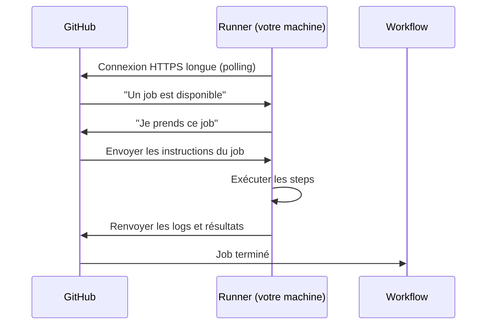

## Pourquoi des runners auto-hébergés ?

Les runners hébergés par GitHub sont excellents pour la majorité des cas. Mais certains scénarios nécessitent des runners sur votre propre infrastructure :

| Besoin                              | Explication                                                        |
|-------------------------------------|--------------------------------------------------------------------|
| **Accès à des ressources privées**  | Base de données interne, API derrière VPN, registre privé          |
| **Performances spécifiques**        | CPU/RAM/GPU dédiés, stockage NVMe, réseau rapide                   |
| **Conformité et souveraineté**      | Les données ne doivent jamais quitter votre datacenter              |
| **Coût à grande échelle**           | Des milliers de minutes/jour coûtent moins cher sur des machines propres |
| **Environnement reproductible**     | Logiciels spécialisés pré-installés, drivers propriétaires          |
| **Déploiement dans un réseau privé**| kubectl vers un cluster non exposé sur internet                     |

## Architecture d'un self-hosted runner



Le runner est un agent **qui tire** les jobs depuis GitHub (poll sortant). Il n'y a pas de connexion entrante — votre machine n'a pas besoin d'être accessible depuis internet.

**Exigences réseau** : seule une connexion **HTTPS sortante** vers `github.com` et `*.actions.githubusercontent.com` est nécessaire.

## Modes d'enregistrement : Repository, Organization, Enterprise

Un runner peut être enregistré à trois niveaux :

| Niveau         | Portée                                   | Configuration                                 |
|----------------|------------------------------------------|-----------------------------------------------|
| **Repository** | Un seul dépôt                            | Settings → Actions → Runners                 |
| **Organization** | Tous les dépôts de l'org             | Org Settings → Actions → Runners             |
| **Enterprise** | Tous les dépôts de l'enterprise          | Enterprise Settings → Actions → Runners      |

Pour les runners Kubernetes en contexte personnel, le niveau **Organization** est recommandé : un seul pool de runners sert tous vos dépôts.

## Les labels — router les jobs vers les bons runners

Chaque runner possède des **labels** qui permettent de cibler les jobs vers un type de runner spécifique.

Labels automatiques attribués à tout runner :

- `self-hosted` : identifie un runner auto-hébergé (vs `ubuntu-latest` qui est hébergé par GitHub)
- `linux` / `windows` / `macOS` : système d'exploitation
- `x64` / `ARM` / `ARM64` : architecture

Labels personnalisés que vous définissez :

```yaml
# Cibler un runner avec des capacités spécifiques
jobs:
  build-gpu:
    runs-on: [self-hosted, linux, gpu]

  deploy-internal:
    runs-on: [self-hosted, linux, k8s-cluster]

  test-database:
    runs-on: [self-hosted, linux, db-access]
```

## Sécurité des self-hosted runners

> **Attention** : les self-hosted runners présentent des risques de sécurité différents des runners GitHub.

### Risques principaux

1. **Persistance entre les runs** : contrairement aux runners GitHub qui sont éphémères, un self-hosted runner par défaut conserve son état entre les jobs. Un job malveillant peut déposer des fichiers ou modifier la configuration pour affecter les runs suivants.

2. **Accès aux secrets de la machine** : si le runner tourne sous un compte avec des droits élevés, un job malveillant peut accéder aux credentials de la machine hôte.

3. **Repos publics** : ne jamais utiliser des self-hosted runners avec des dépôts publics. N'importe qui peut forker un repo public et soumettre une PR qui exécutera du code arbitraire sur votre runner.

### Bonnes pratiques

- **Runners éphémères** : configurez les runners pour se supprimer après chaque job (`--ephemeral`). C'est le comportement par défaut avec ARC sur Kubernetes.
- **Isolation** : exécutez les runners dans des conteneurs ou des VMs (comme sur Kubernetes).
- **Compte dédié** : faites tourner le runner sous un compte système sans droits particuliers.
- **Repos privés uniquement** : n'assignez jamais de self-hosted runners à des dépôts publics.
- **Network policies** : restreignez ce que le runner peut contacter sur le réseau interne.

## Ajouter un runner manuellement (sans Kubernetes)

Pour comprendre le mécanisme avant de passer à Kubernetes, voici comment ajouter un runner "à la main" sur une VM Linux :

```bash
# 1. Créer un utilisateur dédié
sudo useradd -m -s /bin/bash github-runner
sudo su - github-runner

# 2. Télécharger le runner
mkdir actions-runner && cd actions-runner
curl -o actions-runner-linux-x64-2.322.0.tar.gz -L \
  https://github.com/actions/runner/releases/download/v2.322.0/actions-runner-linux-x64-2.322.0.tar.gz
tar xzf ./actions-runner-linux-x64-2.322.0.tar.gz

# 3. Récupérer le token d'enregistrement depuis GitHub
# Settings → Actions → Runners → New self-hosted runner → copier le token

# 4. Configurer le runner
./config.sh \
  --url https://github.com/votre-org \
  --token AXXXXXXXXXXXXXXX \
  --name mon-runner \
  --labels self-hosted,linux,x64 \
  --runnergroup Default \
  --work _work \
  --ephemeral                    # Runner éphémère : se supprime après chaque job

# 5. Installer comme service systemd
sudo ./svc.sh install github-runner
sudo ./svc.sh start
```

Ce runner est fonctionnel mais fragile (une seule instance, pas de scaling, gestion manuelle des mises à jour). C'est pour ça qu'on utilise Kubernetes avec ARC.

## Utiliser un self-hosted runner dans un workflow

```yaml
jobs:
  deploy-private:
    runs-on: [self-hosted, linux, x64]    # Cibler les runners self-hosted
    steps:
      - uses: actions/checkout@v4
      - run: kubectl apply -f k8s/
```

La différence avec `runs-on: ubuntu-latest` est uniquement dans la valeur de `runs-on`. Tout le reste du workflow est identique.
