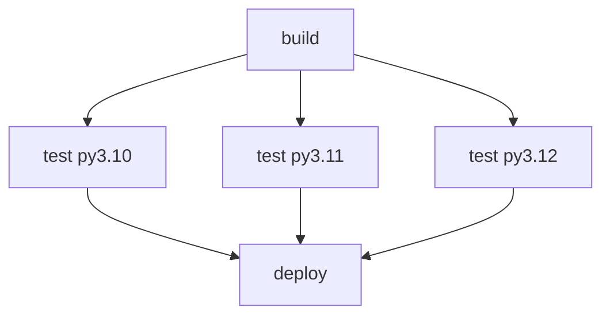

## La stratégie de matrice

La stratégie `matrix` permet d'exécuter un même job plusieurs fois avec des **paramètres différents**. C'est l'outil idéal pour tester sur plusieurs versions, plusieurs systèmes ou plusieurs configurations sans dupliquer le code.

### Syntaxe de base

```yaml
jobs:
  test:
    runs-on: ubuntu-latest
    strategy:
      matrix:
        python-version: ["3.10", "3.11", "3.12"]

    steps:
      - uses: actions/checkout@v6

      - uses: actions/setup-python@v5
        with:
          python-version: ${{ matrix.python-version }}

      - run: pytest
```

Ce workflow crée **3 jobs en parallèle**, un par version Python. L'interface GitHub les affiche clairement :

```text
test (3.10) ✓
test (3.11) ✓
test (3.12) ✓
```

### Matrice multi-dimensionnelle

On peut combiner plusieurs axes :

```yaml
strategy:
  matrix:
    os: [ubuntu-latest, windows-latest, macos-latest]
    python-version: ["3.11", "3.12"]
```

Cela crée **3 × 2 = 6 jobs** : toutes les combinaisons `os × python-version`.

Pour utiliser les variables dans le job :

```yaml
jobs:
  test:
    runs-on: ${{ matrix.os }}
    strategy:
      matrix:
        os: [ubuntu-latest, windows-latest]
        python-version: ["3.11", "3.12"]
    steps:
      - uses: actions/setup-python@v5
        with:
          python-version: ${{ matrix.python-version }}
```

### Inclure et exclure des combinaisons

```yaml
strategy:
  matrix:
    os: [ubuntu-latest, windows-latest]
    python-version: ["3.10", "3.11", "3.12"]
    exclude:
      # Exclure une combinaison spécifique
      - os: windows-latest
        python-version: "3.10"
    include:
      # Ajouter des combinaisons supplémentaires avec des variables extra
      - os: ubuntu-latest
        python-version: "3.12"
        experimental: true
        coverage: true
```

La variable `matrix.coverage` ou `matrix.experimental` n'existe que pour cette combinaison spécifique — utile pour activer des comportements conditionnels.

### `fail-fast` et `max-parallel`

```yaml
strategy:
  fail-fast: false # Ne pas annuler les autres jobs si l'un échoue
  max-parallel: 2 # Limiter à 2 jobs simultanés (contrôle de coût)
  matrix:
    python-version: ["3.10", "3.11", "3.12"]
```

Par défaut, `fail-fast: true` annule tous les jobs de la matrice dès qu'un seul échoue. Mettre à `false` permet d'obtenir le résultat de toutes les combinaisons même en cas d'échec partiel — souvent plus informatif pour les rapports de compatibilité.

## Parallélisme entre jobs

Sans matrice, plusieurs jobs d'un même workflow s'exécutent en parallèle **par défaut** :

```yaml
jobs:
  lint:
    runs-on: ubuntu-latest
    steps:
      - uses: actions/checkout@v6
      - run: ruff check .

  type-check:
    runs-on: ubuntu-latest
    steps:
      - uses: actions/checkout@v6
      - run: mypy app/

  test:
    runs-on: ubuntu-latest
    steps:
      - uses: actions/checkout@v6
      - run: pytest
```

Ces trois jobs démarrent simultanément. Le workflow est considéré comme réussi uniquement quand **tous** les jobs ont réussi.

### Fan-out / Fan-in

Le pattern **fan-out / fan-in** consiste à lancer plusieurs jobs en parallèle puis à attendre qu'ils soient tous terminés avant de continuer :



```yaml
jobs:
  build:
    runs-on: ubuntu-latest
    steps:
      - run: echo "build"
      - uses: actions/upload-artifact@v4
        with:
          name: dist
          path: dist/

  test:
    needs: build # Fan-out après build
    runs-on: ubuntu-latest
    strategy:
      matrix:
        python-version: ["3.10", "3.11", "3.12"]
    steps:
      - uses: actions/download-artifact@v4
        with:
          name: dist
          path: dist/
      - run: pytest

  deploy:
    needs: test # Fan-in : attend TOUS les tests
    runs-on: ubuntu-latest
    steps:
      - run: echo "deploy"
```

Avec `needs: test`, le job `deploy` attend que **toutes les combinaisons** de la matrice `test` aient réussi.

## Concurrence et groupes de concurrence

Le mécanisme `concurrency` empêche plusieurs exécutions du même workflow de tourner simultanément. Utile pour éviter des déploiements parallèles.

```yaml
concurrency:
  group: ${{ github.workflow }}-${{ github.ref }}
  cancel-in-progress: true
```

Avec cette configuration :

- Deux pushes rapides sur `main` → le premier workflow est annulé quand le second démarre.
- `group` est la clé d'identification : les runs avec la même clé sont mutuellement exclusifs.
- `cancel-in-progress: true` annule l'exécution précédente plutôt que d'attendre.

Un exemple plus sophistiqué qui ne cancelle pas en production :

```yaml
concurrency:
  group: deploy-${{ github.ref }}
  cancel-in-progress: ${{ github.ref != 'refs/heads/main' }}
```

Sur les branches de feature, les builds redondants sont annulés. Sur `main`, les builds ne sont jamais annulés — on attend que le déploiement précédent se termine.

## Matrice dynamique

La matrice peut être construite dynamiquement à partir de l'output d'un job précédent :

```yaml
jobs:
  discover-tests:
    runs-on: ubuntu-latest
    outputs:
      test-suites: ${{ steps.find.outputs.suites }}
    steps:
      - uses: actions/checkout@v6
      - id: find
        run: |
          # Trouver tous les dossiers de test et en faire une liste JSON
          SUITES=$(find tests/ -mindepth 1 -maxdepth 1 -type d | jq -R -s -c 'split("\n")[:-1]')
          echo "suites=$SUITES" >> $GITHUB_OUTPUT

  test:
    needs: discover-tests
    runs-on: ubuntu-latest
    strategy:
      matrix:
        suite: ${{ fromJson(needs.discover-tests.outputs.test-suites) }}
    steps:
      - uses: actions/checkout@v6
      - run: pytest ${{ matrix.suite }}
```

La fonction `fromJson()` convertit une chaîne JSON en objet YAML — c'est le pont entre les outputs de jobs (toujours des strings) et la matrice (qui attend un tableau).

> **Exercice** : Dans `mon-app`, modifiez le workflow CI pour tester sur Python 3.11 **et** 3.12 en parallèle. Configurez `fail-fast: false` pour toujours obtenir les résultats des deux versions même si l'une échoue.

<details>
<summary>Solution</summary>

```yaml
name: CI

on:
  push:
    branches: [main]
  pull_request:
    branches: [main]

jobs:
  test:
    runs-on: ubuntu-latest
    strategy:
      fail-fast: false
      matrix:
        python-version: ["3.11", "3.12"]

    steps:
      - name: Cloner le code
        uses: actions/checkout@v6

      - name: Installer Python ${{ matrix.python-version }}
        uses: actions/setup-python@v5
        with:
          python-version: ${{ matrix.python-version }}
          cache: "pip"

      - name: Installer les dépendances
        run: |
          pip install -r requirements.txt
          pip install -r requirements-dev.txt

      - name: Lancer les tests
        run: pytest --cov=app --cov-report=xml

      - name: Uploader le rapport de coverage
        uses: actions/upload-artifact@v4
        if: always()
        with:
          name: coverage-${{ matrix.python-version }}
          path: coverage.xml
```

Les artifacts sont nommés `coverage-3.11` et `coverage-3.12` pour éviter les conflits de noms entre les jobs de la matrice.

</details>
