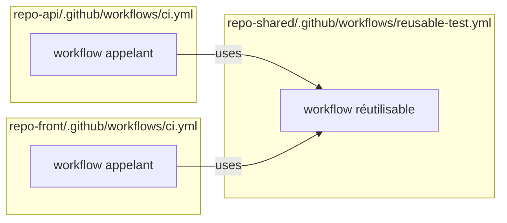

## Le problème de la duplication

Sans mécanisme de réutilisation, les équipes copient-collent les mêmes workflows entre plusieurs dépôts. Quand un bug ou une amélioration survient, il faut propager le changement manuellement partout. GitHub Actions fournit deux solutions :

- **Reusable workflows** : réutiliser un workflow entier comme un job.
- **Composite actions** : réutiliser un ensemble de steps comme une action.



## Reusable workflows

### Créer un workflow réutilisable

Un workflow réutilisable se déclare avec le déclencheur `workflow_call` :

```yaml
# .github/workflows/reusable-test.yml
name: Tests réutilisables

on:
  workflow_call:                          # ← Ce déclencheur le rend réutilisable
    inputs:
      python-version:
        description: "Version Python"
        type: string
        default: "3.12"
      working-directory:
        description: "Dossier racine du projet"
        type: string
        default: "."
    secrets:
      CODECOV_TOKEN:                      # Les secrets sont déclarés explicitement
        required: false
    outputs:
      coverage-percentage:               # Ce workflow peut retourner des valeurs
        description: "Pourcentage de coverage"
        value: ${{ jobs.test.outputs.coverage }}

jobs:
  test:
    runs-on: ubuntu-latest
    outputs:
      coverage: ${{ steps.coverage.outputs.percentage }}
    defaults:
      run:
        working-directory: ${{ inputs.working-directory }}
    steps:
      - uses: actions/checkout@v6

      - uses: actions/setup-python@v5
        with:
          python-version: ${{ inputs.python-version }}
          cache: pip

      - run: pip install -r requirements.txt -r requirements-dev.txt

      - run: pytest --cov=app --cov-report=xml

      - id: coverage
        run: |
          COVERAGE=$(python -c "import xml.etree.ElementTree as ET; \
            tree = ET.parse('coverage.xml'); \
            print(round(float(tree.getroot().get('line-rate')) * 100, 1))")
          echo "percentage=$COVERAGE" >> $GITHUB_OUTPUT

      - uses: actions/upload-artifact@v4
        with:
          name: coverage-report
          path: coverage.xml
```

### Appeler un workflow réutilisable

```yaml
# .github/workflows/ci.yml (dans un autre dépôt ou le même)
name: CI

on:
  push:
    branches: [main]

jobs:
  test:
    uses: mon-org/shared-workflows/.github/workflows/reusable-test.yml@main
    with:
      python-version: "3.12"
    secrets:
      CODECOV_TOKEN: ${{ secrets.CODECOV_TOKEN }}

  deploy:
    needs: test
    runs-on: ubuntu-latest
    steps:
      - run: echo "Coverage = ${{ needs.test.outputs.coverage-percentage }}%"
```

La syntaxe pour référencer un workflow réutilisable :
- **Même dépôt** : `./.github/workflows/reusable-test.yml`
- **Autre dépôt** : `owner/repo/.github/workflows/file.yml@ref`
  - `@main` → branche
  - `@v1.2.0` → tag
  - `@abc1234` → SHA (plus sécurisé)

### Transmission des secrets

```yaml
# Passer TOUS les secrets de l'appelant au workflow réutilisable
jobs:
  test:
    uses: ./. github/workflows/reusable-test.yml
    secrets: inherit                      # Transmet tous les secrets automatiquement
```

`secrets: inherit` est pratique mais moins explicite — préférez lister les secrets individuellement pour des raisons de clarté et de sécurité.

## Composite actions

Une **composite action** regroupe des steps et se comporte comme une action normale (`uses`). Elle est définie dans un fichier `action.yml`.

### Créer une composite action

```yaml
# .github/actions/python-setup/action.yml
name: "Setup Python Environment"
description: "Installe Python, les dépendances et configure ruff"

inputs:
  python-version:
    description: "Version Python"
    required: false
    default: "3.12"
  install-dev:
    description: "Installer les dépendances de dev"
    required: false
    default: "true"

outputs:
  python-path:
    description: "Chemin vers l'exécutable Python"
    value: ${{ steps.setup.outputs.python-path }}

runs:
  using: "composite"                      # ← Type composite
  steps:
    - id: setup
      uses: actions/setup-python@v5
      with:
        python-version: ${{ inputs.python-version }}
        cache: pip

    - name: Installer les dépendances de base
      shell: bash
      run: pip install -r requirements.txt

    - name: Installer les dépendances de dev
      if: ${{ inputs.install-dev == 'true' }}
      shell: bash
      run: pip install -r requirements-dev.txt
```

> Important : dans une composite action, chaque step doit préciser `shell: bash` (ou le shell de votre choix) car il n'y a pas de valeur par défaut.

### Utiliser la composite action

```yaml
steps:
  - uses: actions/checkout@v6

  - uses: ./.github/actions/python-setup
    with:
      python-version: "3.12"

  - run: pytest
```

## Reusable workflow vs Composite action — quand utiliser quoi ?

| Critère                            | Reusable workflow         | Composite action          |
|------------------------------------|---------------------------|---------------------------|
| Niveau de réutilisation            | Jobs entiers              | Steps                     |
| Runner                             | Configurable dans le workflow réutilisable | Hérite du job appelant  |
| Appel depuis                       | `jobs.<id>.uses`          | `steps.<id>.uses`         |
| Secrets                            | Doivent être transmis explicitement | Héritent du job         |
| Parallélisme interne               | Oui (plusieurs jobs)      | Non (séquentiel)          |
| Partage entre dépôts               | Oui                       | Oui                       |

En règle générale :
- Utilisez une **composite action** pour factoriser des steps répétées dans un job (ex : setup de l'environnement).
- Utilisez un **reusable workflow** pour factoriser des pipelines entiers partagés entre plusieurs dépôts.

## Organiser les workflows partagés

Pour une organisation GitHub, la convention est de centraliser les workflows réutilisables dans un dépôt dédié, souvent appelé `.github` ou `shared-workflows` :

```
mon-org/
├── .github/                       # Repo spécial de profil d'organisation
│   └── workflows/
│       ├── reusable-ci-python.yml
│       ├── reusable-ci-node.yml
│       └── reusable-deploy-k8s.yml
├── repo-api/
│   └── .github/workflows/ci.yml  # Appelle les workflows partagés
└── repo-front/
    └── .github/workflows/ci.yml
```

> **Exercice** : Extrayez la logique de test de `mon-app` dans un reusable workflow nommé `reusable-python-tests.yml`. Ce workflow doit accepter en input la version Python et retourner en output le pourcentage de coverage. Le workflow principal `ci.yml` doit l'appeler.

<details>
<summary>Solution</summary>

```yaml
# .github/workflows/reusable-python-tests.yml
name: Tests Python (réutilisable)

on:
  workflow_call:
    inputs:
      python-version:
        type: string
        default: "3.12"
    outputs:
      coverage:
        description: "Pourcentage de coverage"
        value: ${{ jobs.test.outputs.coverage }}

jobs:
  test:
    runs-on: ubuntu-latest
    outputs:
      coverage: ${{ steps.parse-coverage.outputs.pct }}
    steps:
      - uses: actions/checkout@v6

      - uses: actions/setup-python@v5
        with:
          python-version: ${{ inputs.python-version }}
          cache: pip

      - run: pip install -r requirements.txt -r requirements-dev.txt

      - run: pytest --cov=app --cov-report=xml --cov-report=term

      - id: parse-coverage
        run: |
          PCT=$(python -c "
          import xml.etree.ElementTree as ET
          tree = ET.parse('coverage.xml')
          rate = float(tree.getroot().get('line-rate'))
          print(round(rate * 100, 1))
          ")
          echo "pct=$PCT" >> $GITHUB_OUTPUT

      - uses: actions/upload-artifact@v4
        if: always()
        with:
          name: coverage-${{ inputs.python-version }}
          path: coverage.xml
```

```yaml
# .github/workflows/ci.yml
name: CI

on:
  push:
    branches: [main]
  pull_request:
    branches: [main]

jobs:
  test-311:
    uses: ./.github/workflows/reusable-python-tests.yml
    with:
      python-version: "3.11"

  test-312:
    uses: ./.github/workflows/reusable-python-tests.yml
    with:
      python-version: "3.12"

  report:
    needs: [test-311, test-312]
    runs-on: ubuntu-latest
    steps:
      - run: |
          echo "Coverage Python 3.11 : ${{ needs.test-311.outputs.coverage }}%"
          echo "Coverage Python 3.12 : ${{ needs.test-312.outputs.coverage }}%"
```

</details>
